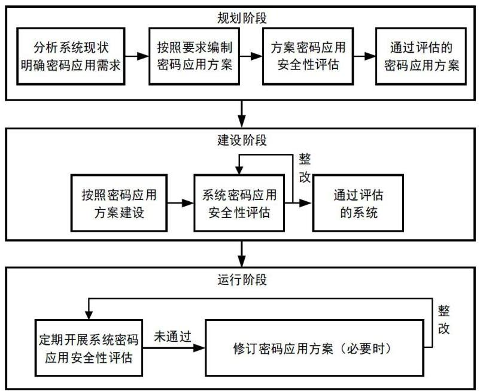
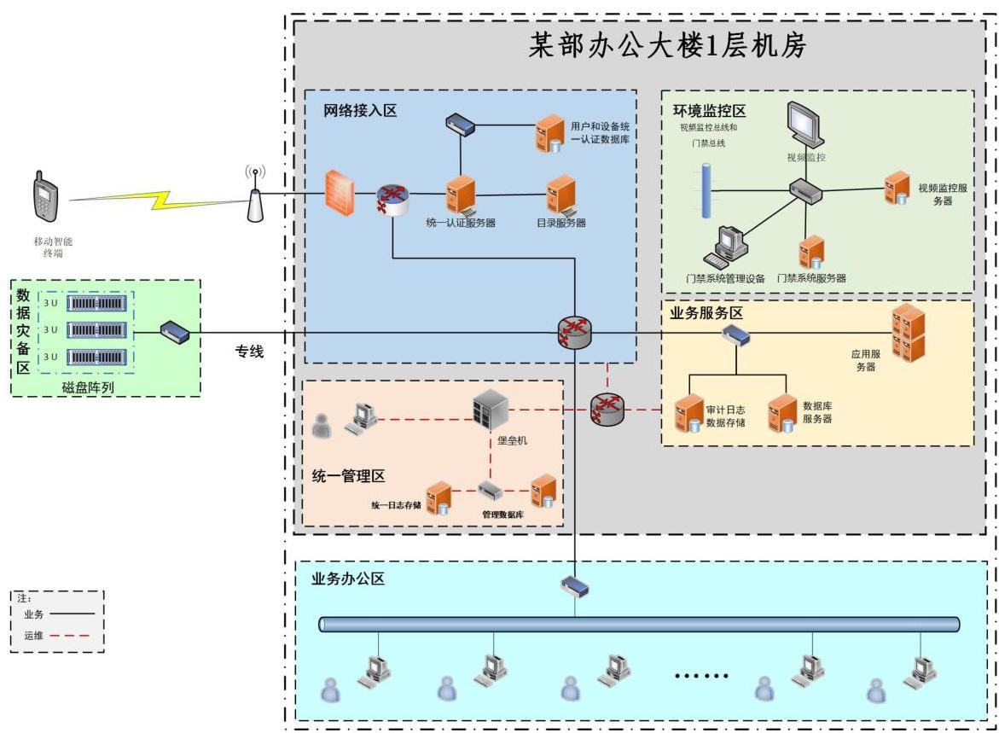
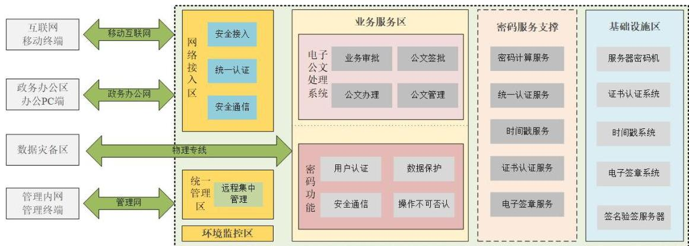
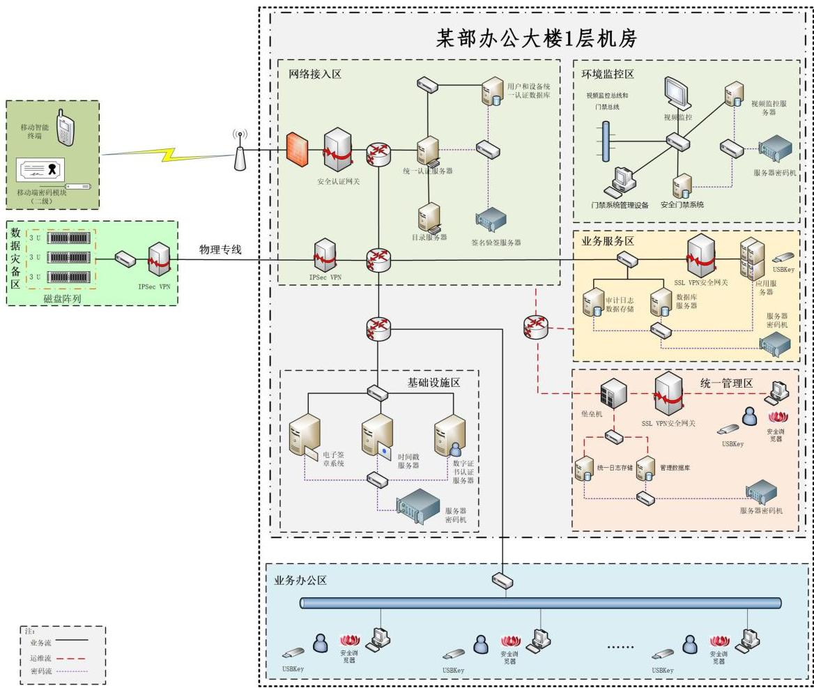

## 一、政务信息系统密码应用与安全性评估实施过程指南

本章根据《国家政务信息化项目建设管理办法》（以下简称《办法》）和《商用密码应用安全性评估管理办法（试行）》等相关要求，参照GM/T 0054-2018《信息系统密码应用基本要求》（以下简称《基本要求》）给出政务信息系统在规划阶段、建设阶段和运行阶段的密码应用与安全性评估实施过程指南。

### （一）过程概述

《办法》第十五条要求“项目建设单位应当落实国家密码管理有关法律法规和标准规范的要求，同步规划、同步建设、同步运行密码保障系统并定期进行评估”，即政务信息系统中的密码保障系统应做到“三同步一评估”。政务信息系统的密码应用与安全性评估贯穿于系统的规划、建设和运行阶段，其实施过程如图1所示。

图1 政务信息系统密码应用与安全性评估实施过程示意图

《办法》所指项目建设单位、使用单位、审批部门、主管部门等承担项目规划、审批、建设和资金管理等职能部门中的密码管理机构，应按职责做好相关项目密码应用与安全性评估工作的指导、评价、督促，对密码应用方案、密码应用安全性评估报告（以下简称“密评报告”）及相关工作质量进行把关，对密码应用、密码保障系统建设、密评实施、整改时限等提出要求，向相关主责部门提出工作建议，有关情况及时向国家密码管理部门报告。国家密码管理部门将建立完善国家政务信息系统密码应用信息库，对国家政务信息系统密码应用及其密评情况实施台账管理。

### （二）规划阶段

在政务信息系统规划阶段，项目建设单位分析系统现状，对系统面临的安全风险和风险控制需求进行分析，明确密码应用需求，根据系统的网络安全保护等级，依据《基本要求》等相关标准，参照政务信息系统密码应用方案模板（见附录1），编制政务信息系统密码应用方案，从《商用密码应用安全性评估试点机构目录》（可通过访问“国家密码管理局官方网站-通知公告-国家密码管理局第40号公告”获取）中选择商用密码应用安全性评估机构（以下简称“密评机构”）进行商用密码应用安全性评估（以下简称“密评”）。密码应用方案通过密评是项目立项的必要条件。

### （三）建设阶段

在政务信息系统建设阶段，系统集成单位在项目建设单位的明确要求下按照通过密评的密码应用方案建设密码保障系统，确保系统密码应用符合国家密码管理要求。建设阶段涉及密码应用方案调整优化的，应委托密评机构再次对调整后的密码应用方案进行确认。系统建设完成后，项目建设单位委托密评机构对系统开展密评。系统通过密评是项目验收的必要条件。

未通过密评的政务信息系统，项目建设单位针对评估中发现的安全问题及时整改，整改完成后可请密评机构进行复评，更新评估结果。仍未通过的，不得通过项目验收。

### （四）运行阶段

在政务信息系统运行阶段，项目使用单位定期委托密评机构对系统开展密评，网络安全保护等级第三级及以上的政务信息系统，每年至少密评一次，可与关键信息基础设施安全检测评估、网络安全等级测评等工作统筹考虑、协调开展。

政务信息系统运行期间的密码应用安全应遵循持续改进的原则，根据安全需求、系统脆弱性、风险威胁程度、系统环境变化以及对系统安全认识的深化等，及时检查、总结、调整现有的密码应用措施，确认系统各项密码技术和管理措施是否落实到位。若系统约束条件发生重要变化，必要时，项目使用单位需修订密码应用方案，对系统进行升级改造。运行后的政务信息系统密评未通过的，项目使用单位按要求对系统进行整改后再次开展密评，整改期间项目使用单位应保证系统的安全性。

## 二、政务信息系统密码应用措施指南

本章依据《基本要求》，结合当前密码技术、产品和服务的实际情况，给出了针对政务信息系统密码应用的措施建议。项目建设单位也可结合实际，自主选取适合的密码技术、产品和服务，以满足相关密码应用要求。

### （一）总体要求

总体上，项目建设单位需从物理和环境安全、网络和通信安全、设备和计算安全、应用和数据安全等四个层面采用密码技术措施，建立安全的密钥管理方案，并采取有效的安全管理措施，对政务信息系统进行保护。

政务信息系统需使用经检测认证合格的商用密码产品或服务，使用的商用密码算法、技术应遵循密码相关国家标准和行业标准（标准目录参见附录2），没有标准可遵循时可提请国家密码管理部门组织对相关算法、技术进行安全性审查。政务信息系统采用电子认证服务的，项目建设单位需选择具有电子政务电子认证服务资质的机构（机构目录可通过访问“国家密码管理局官方网站-在线服务-行政审批结果查询”获取）。

### （二）物理和环境安全

主要是实现对信息系统所在机房等重要区域的物理防护，应具备的密码功能包括：

1. 确认进入各重要区域人员的身份，防止无关和假冒人员进入；
2. 保护电子门禁系统进出记录和视频监控音像记录的完整性，防止被非授权篡改。

实现上述功能，可结合政务信息系统的网络安全保护等级选用以下密码应用措施：

1. 部署基于密码技术的电子门禁系统（可参考 GB/T 37033-2018《信息安全技术 射频识别系统密码应用技术要求》、GM/T 0036-2014《采用非接触卡的门禁系统密码应用技术指南》等标准），对重要物理区域（如计算机集中办公区、设备机房等）出入人员的身份进行鉴别，并对电子门禁系统进出记录等数据进行完整性保护；
2. 部署基于密码技术的视频监控系统，对视频监控音像记录等数据进行完整性保护。

### （三）网络和通信安全

主要是实现对信息系统与外部实体之间网络通信的安全防护，应具备的密码功能包括：

1. 确认通信实体的身份，防止与假冒实体进行通信；
2. 保护通信过程中的数据，防止数据被非授权篡改，防止敏感数据泄露。

实现上述功能，在非安全网络信道中传输敏感数据时，可结合政务信息系统的网络安全保护等级选用以下密码应用措施：

1. 部署 IPSec VPN 类产品（符合 GM/T 0022-2014《IPSec VPN 技术规范》、GM/T 0023-2014《IPSec VPN 网关产品规范》等标准），实现通信双方的身份鉴别，通信过程中敏感数据的机密性、完整性保护；
2. 部署 SSL VPN 类产品（符合 GM/T 0024-2014《SSL VPN 技术规范》、GM/T 0025-2014《SSL VPN 网关产品规范》等标准），实现通信双方的身份鉴别，通信过程中敏感数据的机密性、完整性保护。

### （四）设备和计算安全

主要是实现对信息系统中各类设备和计算环境的安全防护，应具备的密码功能包括：

1. 对设备的特权用户（含系统管理员、安全管理员、审计管理员等，以下简称“管理员”）和普通用户的身份进行识别和确认，防止假冒人员登录；
2. 在远程管理时，对管理员的身份鉴别信息（如口令等）进行机密性保护，防止鉴别信息泄漏；
3. 保护计算机、服务器等设备中的系统资源访问控制信息（如设备配置信息、安全策略、资源访问控制列表等）、重要信息资源安全标记（如数据标签等）、日志记录（如系统日志、数据库日志等）和重要可执行程序（如重要应用程序、关键系统文件等），防止被非授权篡改。

实现上述密码功能，在计算机终端和服务器上，可结合政务信息系统的网络安全保护等级选用以下密码应用措施：

1. 部署智能密码钥匙、智能 IC 卡或其它具备身份鉴别功能的密码产品，对登录的用户进行身份鉴别；
2. 为远程管理搭建安全通信链路（如 SSL 通道），保护鉴别信息的机密性；
3. 部署可信计算密码支撑平台、签名验签服务器或服务器密码机，实现可信计算能力，建立从系统到应用的信任链，保护重要信息的完整性，保证计算环境的安全可信。

### （五）应用和数据安全

主要是实现对信息系统中应用及其数据的安全防护，应具备的密码功能包括：

1. 确认应用系统的管理员和普通用户的身份，防止假冒人员登录；
2. 对应用系统的访问控制策略（如安全策略、资源访问控制列表等）、数据库表访问控制信息（如用户身份信息、数据库安全策略、用户权限列表等）、重要信息资源安全标记（如数据标签）等进行保护，防止被非授权篡改；
3. 保护客户端与服务器之间、应用系统之间在非安全网络信道中传输的重要数据（包括但不限于鉴别数据、重要业务数据、重要用户信息等），防止数据泄露；
4. 保护存储的重要数据（包括但不限于鉴别数据、重要业务数据、重要用户信息等），防止数据泄露、非授权篡改；
5. 保护重要日志记录（如认证登录日志、配置操作日志等），防止被非授权篡改；
6. 保护可能涉及法律责任认定的应用系统中的数据发送和数据接收操作，确保发送方和接收方对已经发生的操作行为无法否认。

实现上述功能，可结合政务信息系统的网络安全保护等级选用以下密码应用措施：

1. 部署证书认证系统 *（注：当政务信息系统对外提供电子认证服务时，应当取得电子政务电子认证服务资质。）* 或直接采用具有电子政务电子认证服务资质的机构提供的电子认证服务，为用户配置智能密码钥匙、智能IC卡、移动智能终端密码模块等具备身份鉴别功能的密码产品，对系统用户身份进行管理；

2. 部署安全认证网关系统，对访问应用服务器的用户进行身份鉴别和权限控制，对客户端与服务器端、应用系统之间传输的数据进行机密性和完整性保护；

3. 部署存储加密产品、服务器密码机或其他密码模块，对存储的重要数据进行机密性和完整性保护；

4. 部署签名验签服务器、服务器密码机或其他密码模块，对存储的日志记录进行完整性保护；

5. 根据应用系统的需要，部署签名验签服务器、电子签章系统、时间戳服务器等密码产品，对收发的数据及相关操作记录进行签名，实现数据原发行为的不可否认性和数据接收行为的不可否认性。

### （六）密钥管理

在政务信息系统密码应用方案中，需包含完整的密钥管理方案，明确采用的密钥种类及管理环节，并设计安全的技术实现方式，确保密钥的生成、存储、分发、导入、导出、使用、备份、恢复、归档、销毁等全生命周期的安全。

密钥管理方案的技术实现需由通过检测认证的商用密码产品提供。未经检测认证的密钥管理方案技术实现可提请国家密码管理部门组织开展安全性审查。

### （七）安全管理

依据《基本要求》，政务信息系统的安全管理措施包括制度、人员、实施和应急4个方面。

制度方面，项目建设单位和使用单位需建立相应的密码安全管理制度和操作规范，覆盖密码建设、运维、人员、设备、密钥等密码管理相关内容。相关制度可针对密码保障系统单独制定，也可在已有的政务信息系统安全管理相关制度规范中体现。

人员方面，项目建设单位和使用单位需根据政务信息系统密码管理工作需要设立密码管理及操作相关岗位，制订人员岗位责任、人员考核、人员培训、人员保密和调离等相关规定，并按照规定进行人员的配备与管理。

实施方面，项目建设单位和使用单位需参照本指南第一章开展政务信息系统规划、建设和运行的密码应用工作，重点做好密码应用方案设计与密评、密码保障系统建设与密评、以及相关闭环管理工作。

应急安全管理方面，项目建设单位需在项目建设阶段、项目使用单位需在系统运行期间，分别明确典型紧急事件及应急处理处置方案，做好应急资源准备，当事件发生时，按照应急预案结合实际情况及时处置。

## 三、政务信息系统密码应用与安全性评估质量保障指南

本章针对国家政务信息系统建设、使用和集成单位等密码应用与安全性评估责任单位，开展密码应用方案编制、密码保障系统建设等活动提出了质量管理建议，同时提出了密评机构实施密码应用安全性评估的规范性要求。

### （一）项目建设单位和使用单位

项目建设单位需按照本指南第一章要求，在政务信息系统规划阶段，根据系统网络安全保护等级，参照政务信息系统密码应用方案模板（见附录1），编制政务信息系统密码应用方案，并委托密评机构对密码应用方案进行密评。在系统建设阶段，项目建设单位应要求并监督系统集成单位按照通过密评的密码应用方案建设密码保障系统，并在建设完成后，委托密评机构对系统开展密评。政务信息系统投入运行后，项目使用单位应委托密评机构定期对系统进行密评。

编制政务信息系统密码应用方案应遵循以下原则：

**总体性原则。** 密码应用方案应做好顶层设计，明确应用需求和预期目标，与政务信息系统整体网络安全保护等级相结合，通过体系化的设计形成涵盖技术、管理、实施保障的整体方案，有效落实密码应用相关要求。

**完备性原则。** 密码应用方案需紧密结合信息系统业务应用实际与安全保护等级，站在整体角度，通过自上而下的体系化设计，综合考虑物理和环境安全、网络和通信安全、设备和计算安全、应用和数据安全等层面的密码应用需求。

**适用性原则。** 《基本要求》是密码应用的通用要求，在密码应用方案设计中不能机械照搬，或简单地对照每项要求堆砌密码产品，应通过体系化、分层次的设计，形成包括密码支撑总体架构、密码基础设施建设部署、密钥管理体系构建、密码产品部署及管理等内容的总体方案。通过密码应用方案设计，为实现《基本要求》在政务信息系统中的落地创造条件。

### （二）系统集成单位

系统集成单位应严格按照通过密评的密码应用方案开展工程实施、建设密码保障系统。

系统集成单位需做好系统建设过程中的质量控制，明确系统建设实施的组织架构、任务分工及人员安排，明确责任机构和责任人。根据密码应用方案中的实施保障方案，明确密码保障系统建设实施对象的边界及密码应用范围、任务要求，分析系统建设阶段的重难点问题，提出建设阶段可能存在的风险点及应对措施。系统集成单位需制定实施计划，包含实施路线图、进度计划、重要节点等，按照计划确定实施步骤，分阶段描述任务分工、实施主体、阶段交付物等，并提供保障措施，包含系统建设阶段的组织保障、人员保障、经费保障、质量保障、监督检查等措施。

### （三）密评机构

密评机构负责对政务信息系统的密码应用方案进行密评，并对政务信息系统开展密评。

密评机构对政务信息系统的密码应用方案进行密评时，需依据《基本要求》等标准要求，分析密码应用方案是否对政务信息系统中需要保护的资产、数据提供了体系化、完备、适用的密码保障措施。若政务信息系统密码应用方案中存在不适用指标，需对不适用指标及其论证材料进行评估，审核不适用的具体原因的合理性，并审核是否存在可满足安全要求并达到等效控制的其他替代性风险控制措施。

密评机构对政务信息系统开展密评时，需依据《基本要求》《商用密码应用安全性评估管理办法(试行)》《信息系统密码测评要求(试行)》《商用密码应用安全性评估测评过程指南（试行）》《商用密码应用安全性评估测评作业指导书（试行）》等标准规范、指导性文件及管理要求，对照通过密评的密码应用方案，核查不适用指标的条件是否成立、替代性风险控制措施是否落实，从而确定适用和不适用的测评指标，然后从总体要求、物理和环境安全、网络和通信安全、设备和计算安全、应用和数据安全、密钥管理、安全管理等方面开展评估，根据政务信息系统当前的安全状况，给出评估结果并提出有针对性的整改建议。

## 附录 1 政务信息系统密码应用方案模板

政务信息系统密码应用方案

项目名称：

项目建设单位：

编制日期：

#### 编制说明

1.本应用方案由项目建设单位组织编写并提交。

2.编写要求：

(1) 语言规范、文字简练、重点突出、描述清晰、内容全面、附件齐全；

(2) 采用 A4 幅面，上、下、左、右边距均为 2.5 厘米；正文内容仿宋四号字，1.5 倍行距；一级标题黑体三号字，二级标题楷体小三号字，三级标题仿宋四号字，各级标题均加黑；

(3) 涉及到的外文缩写要注明全称；

(4) 材料内容不得涉及国家秘密。

#### 目录

一级目录为黑体四号，二级目录为楷体四号，三级目录为仿宋小四。每级目录缩进两个字符。

##### 1 背景

包含系统的建设规划、国家有关法律法规要求、与规划有关的前期情况概述，以及该项目实施的必要性。

##### 2 系统概述

包含系统基本情况、系统网络拓扑、承载的业务情况、系统软硬件构成、管理制度等。

其中，系统基本情况包含系统名称、项目建设单位情况（名称、地址、所属密码管理部门、单位类型等）、系统上线运行时间、完成等保备案时间、网络安全保护等级、系统用户情况（使用单位、使用人员、使用场景等）等。

系统网络拓扑包含体系架构、网络所在机房情况、网络边界划分、设备组成及实现功能、所采取的安全防护措施等，并给出系统网络拓扑图。

承载的业务情况包含系统承载的业务应用、业务功能、信息种类、关键数据类型等。

系统软硬件构成包含服务器、用户终端、网络设备、存储、安全防护设备、密码设备等硬件资源和操作系统、数据库、应用中间件等软件设备资源。

管理制度包含系统管理机构、管理人员、管理职责、管理制度、安全策略等。

##### 3 密码应用需求分析

结合系统安全风险控制需求，以及《基本要求》针对本政务信息系统网络安全保护等级提出的密码应用要求，对系统的密码应用需求进行分析。

对于密码应用要求在本政务信息系统中不适用的部分，做出相应的原因说明，并给出替代性措施。

##### 4 设计目标及原则

###### 4.1 设计目标

提出总的设计目标或分阶段设计目标。

###### 4.2 设计原则与依据

包含方案的设计原则、所遵循的依据等，重点是所遵循的密码相关政策法规要求和《基本要求》等标准规范。

##### 5 技术方案

###### 5.1 密码应用技术框架

包含密码应用技术框架图及框架说明。技术框架应与第3章“密码应用需求”对应，根据密码应用需求设计。

###### 5.2 物理和环境安全

描述本层密码保护的对象、采用的密码措施，包含密码子系统组成和功能、密码产品及其遵循的标准、密码服务、密码算法、密码协议、密码应用工作流程、密钥管理体系与实现等内容。

###### 5.3 网络和通信安全

说明同 5.2。

###### 5.4 设备和计算安全

说明同 5.2。

###### 5.5 应用和数据安全

说明同 5.2。

###### 5.6 密钥管理

描述系统中各密钥全生命周期涉及的密钥管理方案和使用的独立的密钥管理设备、设施（若有）。

###### 5.7 密码应用部署

包含设备选型原则、软硬件设备清单（软硬件设备均需包含已有的密码产品清单）、部署示意图及说明等。

###### 5.8 安全与合规性分析

针对第 3 章中安全需求的满足情况进行分析。

重点对政策法规、标准规范的符合程度进行自我评价。包含《密码应用合规性对照表》，对每一项符合性进行自评价（符合或不适用）。对于自查中不适用的项目，逐一说明其原因（比如环境约束、业务条件约束、经济社会稳定性等），并指出所对应的风险点采用了何种替代性风险控制措施来达到等效控制。

表 1 密码应用合规性对照表

|  指标要求 | 密码技术应用点 | 采取措施 | 标准符合性(符合/不适用) | 说明(针对不适用项说明原因及替代性措施)  |
| --- | --- | --- | --- | --- |
|  物理和环境安全 | 身份鉴别 |  |  |   |
|   |  电子门禁记录数据完整性 |  |  |   |
|   |  视频记录数据完整性 |  |  |   |
|   |  密码模块实现 |  |  |   |
|  网络和通信安全 | 身份鉴别 |  |  |   |
|   |  安全接入认证（四级） |  |  |   |
|   |  访问控制信息完整性 |  |  |   |
|   |  通信数据完整性 |  |  |   |
|   |  通信数据机密性 |  |  |   |
|   |  集中管理通道安全 |  |  |   |
|   |  密码模块实现 |  |  |   |
|  设备和计算安全 | 身份鉴别 |  |  |   |
|   |  远程管理身份鉴别信息机密性 |  |  |   |
|   |  访问控制信息完整性 |  |  |   |
|   |  敏感标记的完整性 |  |  |   |
|   |  日志记录完整性 |  |  |   |
|   |  重要程序或文件完整性 |  |  |   |
|   |  密码模块实现 |  |  |   |
|  应用和数据安全 | 身份鉴别 |  |  |   |
|   |  访问控制信息和敏感标记完整性 |  |  |   |
|   |  数据传输机密性 |  |  |   |
|   |  数据存储机密性 |  |  |   |
|   |  数据传输完整性 |  |  |   |
|   |  数据存储完整性 |  |  |   |
|   |  日志记录完整性 |  |  |   |
|   |  重要应用程序的加载和卸载 |  |  |   |
|   |  抗抵赖（四级） |  |  |   |
|   |  密码模块实现 |  |  |   |

##### 6 安全管理方案

包含系统采取的密码安全相关人员、制度、实施、应急等方面的管理措施。

##### 7 实施保障方案

###### 7.1 实施内容

根据第5章和第6章的设计内容，清晰准确地描述项目实施对象的边界及密码应用的范围、任务要求等。

实施内容包含但不限于采购、软硬件开发或改造、系统集成、综合调试、试运行等。

分析项目实施的重难点问题，提出实施过程中可能存在的风险点及应对措施。

###### 7.2 实施计划

包含实施路线图、进度计划、重要节点等。

按照施工进度计划确定实施步骤，并分阶段描述任务分工、实施主体、项目建设单位、阶段交付物等。

###### 7.3 保障措施

包含项目实施过程中的组织保障、人员保障、经费保障、质量保障、监督检查等措施。

###### 7.4 经费概算

应对密码应用及应用改造项目建设和产生的相关费用进行概算，新增的密码产品和相关服务应描述产品名称和服务类型、数量等。

按照经费使用有关要求编写。

## 附录 2 密码相关标准（截至 2020 年 6 月）

|  序号 | 密码行业标准 |   | 密码国家标准  |   |
| --- | --- | --- | --- | --- |
|   |  标准编号 | 标准名称 | 标准编号 | 标准名称  |
|  1 | GM/T 0001.1-2012 | 祖冲之序列密码算法：第 1 部分：算法描述 | GB/T 33133.1-2016 | 信息安全技术 祖冲之序列密码算法 第 1 部分：算法描述  |
|  2 | GM/T 0001.2-2012 | 祖冲之序列密码算法：第 2 部分：基于祖冲之算法的机密性算法 | /  |   |
|  3 | GM/T 0001.3-2012 | 祖冲之序列密码算法：第 3 部分：基于祖冲之算法的完整性算法  |   |   |
|  4 | GM/T 0002-2012 | SM4 分组密码算法 | GB/T 32907-2016 | 信息安全技术 SM4 分组密码算法  |
|  5 | GM/T 0003.1-2012 | SM2 椭圆曲线公钥密码算法第 1 部分：总则 | GB/T 32918.1-2016 | 信息安全技术 SM2 椭圆曲线公钥密码算法第 1 部分：总则  |
|  6 | GM/T 0003.2-2012 | SM2 椭圆曲线公钥密码算法第 2 部分：数字签名算法 | GB/T 32918.2-2016 | 信息安全技术 SM2 椭圆曲线公钥密码算法第 2 部分：数字签名算法  |
|  7 | GM/T 0003.3-2012 | SM2 椭圆曲线公钥密码算法第 3 部分：密钥交换协议 | GB/T 32918.3-2016 | 信息安全技术 SM2 椭圆曲线公钥密码算法第 3 部分：密钥交换协议  |
|  8 | GM/T 0003.4-2012 | SM2 椭圆曲线公钥密码算法第 4 部分：公钥加密算法 | GB/T 32918.4-2016 | 信息安全技术 SM2 椭圆曲线公钥密码算法第 4 部分：公钥加密算法  |
|  9 | GM/T 0003.5-2012 | SM2 椭圆曲线公钥密码算法第 5 部分：参数定义 | GB/T 32918.5-2017 | 信息安全技术 SM2 椭圆曲线公钥密码算法第 5 部分：参数定义  |
|  10 | GM/T 0004-2012 | SM3 密码杂凑算法 | GB/T 32905-2016 | 信息安全技术 SM3 密码杂凑算法  |
|  11 | GM/T 0005-2012 | 随机性检测规范 | GB/T 32915-2016 | 信息安全技术 二元序列随机性检测方法  |
|  12 | GM/T 0006-2012 | 密码应用标识规范 | GB/T 33560-2017 | 信息安全技术 密码应用标识规范  |
|  13 | GM/T 0008-2012 | 安全芯片密码检测准则 | /  |   |
|  14 | GM/T 0009-2012 | SM2 密码算法使用规范 | GB/T 35276-2017 | 信息安全技术 SM2 密码算法使用规范  |
|  15 | GM/T 0010-2012 | SM2 密码算法加密签名消息语法规范 | GB/T 35275-2017 | 信息安全技术 SM2 密码算法加密签名消息语法规范  |
|  16 | GM/T 0011-2012 | 可信计算 可信密码支撑平台功能与接口规范 | GB/T 29829-2013 | 信息安全技术 可信计算密码支撑平台功能与接口规范  |
|  17 | GM/T 0012-2012 | 可信计算 可信密码模块接口规范 | /  |   |
|  18 | GM/T 0013-2012 | 可信计算 可信密码模块接口符合性测试规范  |   |   |
|  19 | GM/T 0014-2012 | 数字证书认证系统密码协议规范  |   |   |
|  20 | GM/T 0015-2012 | 基于 SM2 密码算法的数字证书格式规范 | GB/T 20518-2018 | 信息安全技术 公钥基础设施 数字证书格式  |
|  21 | GM/T 0016-2012 | 智能密码钥匙密码应用接口规范 | GB/T 35291-2017 | 信息安全技术 智能密码钥匙应用接口规范  |
|  22 | GM/T 0017-2012 | 智能密码钥匙密码应用接口数据格式规范 | /  |   |
|  23 | GM/T 0018-2012 | 密码设备应用接口规范 | GB/T 36322-2018 | 信息安全技术 密码设备应用接口规范  |
|  24 | GM/T 0019-2012 | 通用密码服务接口规范 | /  |   |
|  25 | GM/T 0020-2012 | 证书应用综合服务接口规范  |   |   |
|  26 | GM/T 0021-2012 | 动态口令密码应用技术规范 | GB/T 38556-2020 | 信息安全技术 动态口令密码应用技术规范  |
|  27 | GM/T 0022-2014 | IPSec VPN 技术规范 | GB/T 36968-2018 | 信息安全技术 IPSec VPN 技术规范  |
|  28 | GM/T 0023-2014 | IPSec VPN 网关产品规范 | /  |   |
|  29 | GM/T 0024-2014 | SSL VPN 技术规范 | GB/T 38636-2020 | 信息安全技术 传输层密码协议（TLCP）  |
|  30 | GM/T 0025-2014 | SSL VPN 网关产品规范 | /  |   |
|  31 | GM/T 0026-2014 | 安全认证网关产品规范  |   |   |
|  32 | GM/T 0027-2014 | 智能密码钥匙技术规范  |   |   |
|  33 | GM/T 0028-2014 | 密码模块安全技术要求 | GB/T 37092-2018 | 信息安全技术 密码模块安全要求  |
|  34 | GM/T 0029-2014 | 签名验签服务器技术规范 | GB/T 38629-2020 | 信息安全技术 签名验签服务器技术规范  |
|  35 | GM/T 0030-2014 | 服务器密码机技术规范 | /  |   |
|  36 | GM/T 0031-2014 | 安全电子签章密码技术规范 | GB/T 38540-2020 | 信息安全技术 安全电子签章密码技术规范  |
|  37 | GM/T 0032-2014 | 基于角色的授权与访问控制技术规范 | /  |   |
|  38 | GM/T 0033-2014 | 时间戳接口规范  |   |   |
|  39 | GM/T 0034-2014 | 基于 SM2 密码算法的证书认证系统密码及其相关安全技术规范 | GB/T 25056-2018 | 信息安全技术 证书认证系统密码及其相关安全技术规范  |
|  40 | GM/T 0035.1-2014 | 射频识别系统密码应用技术要求 第 1 部分：密码安全保护框架及安全级别 | GB/T 37033.1-2018 | 信息安全技术 射频识别系统密码应用技术要求 第 1 部分：密码安全保护框架及安全级别  |
|  41 | GM/T 0035.2-2014 | 射频识别系统密码应用技术要求 第 2 部分：电子标签芯片密码应用技术要求 | GB/T 37033.2-2018  |   |
|  42 | GM/T 0035.3-2014 | 射频识别系统密码应用技术要求 第 3 部分：读写器密码应用技术要求 | 信息安全技术 射频识别系统密码应用技术要求 第 2 部分：电子标签芯片密码应用技术要求  |   |
|  43 | GM/T 0035.4-2014 | 射频识别系统密码应用技术要求 第 4 部分：电子标签与读写器通信密码应用技术要求 | GB/T 37033.3-2018  |   |
|  44 | GM/T 0035.5-2014 | 射频识别系统密码应用技术要求 第 5 部分：密钥管理技术要求 | 信息安全技术 射频识别系统密码应用技术要求 第 3 部分：读写器密码应用技术要求  |   |
|  45 | GM/T 0036-2014 | 采用非接触卡的门禁系统密码应用技术指南 |  | /  |
|  46 | GM/T 0037-2014 | 证书认证系统检测规范 |  |   |
|  47 | GM/T 0038-2014 | 证书认证密钥管理系统检测规范 |  |   |
|  48 | GM/T 0039-2015 | 密码模块安全检测要求 | GB/T 38625-2020 | 信息安全技术 密码模块安全检测要求  |
|  49 | GM/T 0040-2015 | 射频识别标签模块密码检测准则 |  |   |
|  50 | GM/T 0041-2015 | 智能 IC 卡密码检测规范 |  | /  |
|  51 | GM/T 0042-2015 | 三元对等密码安全协议测试规范 |  |   |
|  52 | GM/T 0043-2015 | 数字证书互操作检测规范 |  |   |
|  53 | GM/T 0044.1-2016 | SM9 标识密码算法 第 1 部分：总则 | GB/T 38635.1-2020 | 信息安全技术 SM9 标识密码算法 第 1 部分：总则  |
|  54 | GM/T 0044.2-2016 | SM9 标识密码算法 第 2 部分：数字签名算法 | GB/T 38635.2-2020 | 信息安全技术 SM9 标识密码算法 第 2 部分：数字签名算法  |
|  55 | GM/T 0044.3-2016 | SM9 标识密码算法 第 3 部分：密钥交换协议 |  | /  |
|  56 | GM/T 0044.4-2016 | SM9 标识密码算法 第 4 部分：密钥封装机制和公钥加密算法 |  |   |
|  57 | GM/T 0044.5-2016 | SM9 标识密码算法 第 5 部分：参数定义 |  |   |
|  58 | GM/T 0045-2016 | 金融数据密码机技术规范 |  |   |
|  59 | GM/T 0046-2016 | 金融数据密码机检测规范 |  |   |
|  60 | GM/T 0047-2016 | 安全电子签章密码检测规范 |  |   |
|  61 | GM/T 0048-2016 | 智能密码钥匙密码检测规范 |  |   |
|  62 | GM/T 0049-2016 | 密码键盘密码检测规范 |  |   |
|  63 | GM/T 0050-2016 | 密码设备管理 设备管理技术规范 |  |   |
|  64 | GM/T 0051-2016 | 密码设备管理 对称密钥管理技术规范 |  |   |
|  65 | GM/T 0052-2016 | 密码设备管理 VPN 设备监察管理规范 |  |   |
|  66 | GM/T 0053-2016 | 密码设备管理 远程监控与合规性检验接口数据规范 |  |   |
|  67 | GM/T 0054-2018 | 信息系统密码应用基本要求 |  |   |
|  68 | GM/T 0055-2018 | 电子文件密码应用技术规范 |  |   |
|  69 | GM/T 0056-2018 | 多应用载体密码应用接口规范 |  |   |
|  70 | GM/T 0057-2018 | 基于 IBC 技术的身份鉴别规范 |  |   |
|  71 | GM/T 0058-2018 | 可信计算 TCM 服务模块接口规范 |  |   |
|  72 | GM/T 0059-2018 | 服务器密码机检测规范 |  |   |
|  73 | GM/T 0060-2018 | 签名验服务器检测规范 |  |   |
|  74 | GM/T 0061-2018 | 动态口令密码应用检测规范 |  |   |
|  75 | GM/T 0062-2018 | 密码产品随机数检测要求 |  |   |
|  76 | GM/T 0063-2018 | 智能密码钥匙密码应用接口检测规范 |  |   |
|  77 | GM/T 0064-2018 | 限域通信（RCC）密码检测要求 |  |   |
|  78 | GM/T 0065-2019 | 商用密码产品生产和保障能力建设规范 |  |   |
|  79 | GM/T 0066-2019 | 商用密码产品生产和保障能力建设实施指南 |  |   |
|  80 | GM/T 0067-2019 | 基于数字证书的身份鉴别接口规范 |  |   |
|  81 | GM/T 0068-2019 | 开放的第三方资源授权协议框架 |  |   |
|  82 | GM/T 0069-2019 | 开放的身份鉴别框架 |  |   |
|  83 | GM/T 0070-2019 | 电子保单密码应用技术要求 |  |   |
|  84 | GM/T 0071-2019 | 电子文件密码应用指南 | GB/T 38541-2020 | 信息安全技术 电子文件密码应用指南  |
|  85 | GM/T 0072-2019 | 远程移动支付密码应用技术要求 |  |   |
|  86 | GM/T 0073-2019 | 手机银行信息系统密码应用技术要求 |  |   |
|  87 | GM/T 0074-2019 | 网上银行密码应用技术要求 |  |   |
|  88 | GM/T 0075-2019 | 银行信贷信息系统密码应用技术要求 |  |   |
|  89 | GM/T 0076-2019 | 银行卡信息系统密码应用技术要求 |  |   |
|  90 | GM/T 0077-2019 | 银行核心信息系统密码应用技术要求 |  |   |
|  91 | GM/Y 5001-2019 | 密码标准应用指南 |  |   |
|  92 | GM/Y 5002-2018 | 云计算身份鉴别服务密码标准体系 |  |   |
|  93 | GM/Z 4001-2013 | 密码术语 |   |   |
|  94 | / | GB/T 17901.1-2020 | 信息技术 安全技术 密钥管理 第1部分：框架  |   |
|  95 |   |   | GB/T 17964-2008 | 信息安全技术 分组密码算法的工作模式  |
|  96 |   |   | GB/T 32922-2016 | 信息安全技术 IPSec VPN 安全接入基本要求与实施指南  |
|  97 |   |   | GB/T 38647.1-2020 | 信息技术 安全技术 匿名数字签名 第1部分：总则  |
|  98 |   |   | GB/T 38647.2-2020 | 信息技术 安全技术 匿名数字签名 第2部分：采用群组公钥的机制  |

注：国家标准查询网址为 http://openstd.samr.gov.cn， 密码行业标准查询网址为 http://www.gmbz.org.cn。

## 附录 3 某部机关电子公文处理系统密码应用方案示例

### 1 背景

密码是保障网络与信息安全的核心技术和基础支撑，是解决网络与信息安全问题最有效、最可靠、最经济的手段。《密码法》的颁布实施，从法律层面为开展商用密码应用提供了根本遵循，《国家政务信息化项目建设管理办法》的颁布实施，进一步促进了商用密码的全面应用。

我部为贯彻落实《密码法》关于信息系统密码应用的要求，结合《国家电子政务建设指导意见》，决定对已经建成的我部电子公文处理系统进行密码应用改造。

通过对我部电子公文处理系统的现状和密码应用需求进行分析，依据 GM/T 0054-2018《信息系统密码应用基本要求》（以下简称《基本要求》），从物理和环境安全、网络和通信安全、设备和计算安全、应用和数据安全等 4 个层面，以及密钥管理、安全管理等方面，设计了该系统密码应用的技术方案、安全管理方案和实施保障方案。

### 2 系统概述

#### 2.1 基本情况

本系统名称为某部电子公文处理系统，系统建设单位为某部机关，单位地址为 XXXXX，所属密码管理部门为某部办公厅，系统建设单位类型为部机关。

本系统部署在我部局域网，主要服务于我部机关工作人员，为我部内部业务专网，未与其他系统互联。用户可通过部署在我部业务办公区的PC终端浏览器访问登录，也可在互联网通过移动智能终端访问登录。

本系统于2017年5月31日完成网络安全等级保护定级备案（测评机构：XXXXXX，备案编号：XXXXXX），定级等级为第3级（S3A3G3），于2017年12月1日上线运行。

#### 2.2 系统网络拓扑

本系统采用传统IT系统架构，并提供移动智能终端设备在互联网接入所使用的移动互联网络技术，系统网络拓扑如下图1所示：

图1 某部机关电子公文处理系统网络拓扑图

系统部署在我部办公大楼1层机房中，系统网络划分为网络接入区、业务服务区、统一管理区、环境监控区、业务办公区、数据灾备区等六个区。系统网络安全防护符合等保2.0相关要求。

网络接入区位于政务网络边界，部署了统一认证服务器、数据库、目录服务器、交换机等设备，实现对接入用户和设备统一认证。

业务服务区是电子公文处理系统的核心服务区域，主要部署了电子公文处理系统应用服务器、数据存储服务器等设备，实现业务审批、公文签批、公文办理、公文管理等业务过程的信息化管理。

运维管理区主要部署了远程运维管理终端、堡垒机、数据库等设备，实现对系统中的设备集中管理。

环境监控区主要部署了门禁系统和视频监控系统，实现对信息系统机房的物理安防管理。

业务办公区主要部署了办公终端、交换机等设备，实现我部办公人员通过我部政务办公网访问本系统。

数据灾备区主要部署了磁盘阵列等设备，实现重要业务数据的异地备份。

#### 2.3 承载的业务情况

电子公文处理系统是我部日常办公的重要信息系统，为我部各级领导及办公人员提供业务审批、公文签批、公文办理、公文管理等业务过程的信息化管理，实现各部门之间横向与纵向业务流转和内部信息资源共享。该系统由统一身份认证系统和电子公文处理系统两个应用组成，涉及的关键数据包括用户登录身份鉴别数据、电子公文数据等。

#### 2.4 系统软硬件构成

本系统部署有计算机终端、服务器、磁盘阵列、堡垒机、防火墙等硬件设备，机房电子门禁系统通过 ID 卡对进出机房人员进行身份鉴别，使用视频监控系统对机房视频监控数据进行管理，计算机终端通过 IE11 浏览器访问登录电子公文处理系统。

#### 2.5 管理制度

本单位根据等保 2.0 管理要求，制定了通用的《某部信息安全管理制度汇编》，该安全管理制度汇编内容涉及安全管理制度、安全管理机构、人员安全管理、系统建设管理、系统运维管理等 5 个方面的安全管理要求。

### 3 密码应用需求分析

#### 3.1 风险控制需求

根据 GM/T 0054-2018《信息系统密码应用基本要求》，从物理和环境安全、设备和计算安全、应用和数据安全、安全管理等层面，对本系统进行风险分析，得出本系统密码应用需求。

##### 3.1.1 物理和环境安全

###### 1) 风险分析

（1）目前本系统所在机房使用 ID 卡对进入机房人员进行身份鉴别，未使用密码技术对进入机房人员进行身份鉴别，存在非授权人员进入物理环境，对软硬件设备和数据进行直接破坏的风险。

（2）目前本系统所在机房人员进出记录明文存储在门禁管理系统数据库中，视频监控数据明文存储在磁盘阵列中，未使用密码技术进行存储完整性保护，存在物理进出记录和视频记录遭到非授权篡改，以掩盖非授权人员进出情况的风险。

###### 2) 密码应用需求

在本系统所在机房部署符合 GM/T 0036-2014 标准要求的电子门禁系统对进出机房人员进行身份鉴别。并在环境监控区部署符合密码相关国家、行业标准要求的服务器密码机，对门禁进出记录和视频监控数据进行完整性保护。

##### 3.1.2 网络和通信安全

###### 1) 风险分析

（1）目前本系统业务服务区和数据灾备区之间使用专线进行灾备数据传输，通信前未使用密码技术对通信双方进行验证，未使用密码技术对灾备数据传输通道进行机密性和完整性保护，存在非法设备从外部接入内部网络，通信数据在信息系统外部被非授权截取、非授权篡改风险。

（2）目前本系统移动端 App 使用 HTTP 协议建立数据传输通道，未使用密码技术建立安全的数据传输通道，实现数据传输通道机密性和完整性保护，存在通信数据在信息系统外部被非授权截取、非授权篡改风险。

（3）目前本系统管理员用户在政府办公网通过SSH协议登录堡垒机对系统中的安全设备、安全组件进行集中管理，未使用合规的密码协议建立安全管理通道，存在搭建的集中管理通道被非授权使用，或传输的管理数据被非授权获取和非授权篡改风险。

###### 2) 密码应用需求

（1）在本系统网络接入区和数据灾备区分别部署符合密码相关国家、行业标准要求的IPSec VPN，实现在通信前通信双方的身份鉴别，建立安全的灾备数据传输通道。

（2）在本系统移动端 App 中部署符合密码相关国家、行业标准要求的移动端密码模块（二级）、在网络接入区边界部署符合密码相关国家、行业标准要求的 SSL VPN 安全网关，建立安全的移动端 App 数据传输通道。

（3）在本系统统一管理区部署符合密码相关国家、行业标准要求的 SSL VPN 安全网关，建立安全的集中管理通道。

##### 3.1.3 设备和计算安全

###### 1) 风险分析

（1）目前本系统管理员用户在政府办公网通过IE11浏览器，使用用户名口令登录堡垒机，使用SSH协议与堡垒机之间建立安全连接，未使用密码技术对管理员登录进行身份鉴别，未使用合规的密码技术对管理员登录身份鉴别信息进行传输机密性保护，存在设备被非授权人员登录、身份鉴别数据被非授权获取或非授权使用等风险。

（2）目前本系统应用服务器中所有重要程序或文件在生成时未使用密码技术进行完整性保护，使用或读取这些程序和文件时，未对其进行完整性校验，存在重要程序或文件被非授权篡改、来源不可信风险。

（3）目前本系统应用服务器、数据库服务器等设备日志均明文存储，未使用密码技术进行完整性保护，存在设备日志记录被非授权篡改风险。

###### 2) 密码应用需求

（1）分别在本系统业务办公区 PC 端部署具有密码模块的浏览器（以下简称“安全浏览器”），在服务端部署 SSL VPN 安全网关，并向系统管理员配发 USB 接口的智能密码钥匙（以下简称“USBKey”），对登录堡垒机用户进行身份鉴别和远程管理身份鉴别信息传输机密性保护，防止非授权人员登录、管理员远程登录身份鉴别信息被非授权窃取。

（2）在本系统应用服务区部署符合密码相关国家、行业标准要求的服务器密码机，并在应用服务器外挂 USBKey，应用服务器中所有重要程序或文件在生成时通过调用服务器密码机进行完整性保护，使用或读取这些程序和文件时，通过 USBKey 进行验签以确认其完整性；公钥存放在 USBKey 中。

（3）在本系统应用服务区部署符合密码相关国家、行业标准要求的服务器密码机，对应用服务器、数据库服务器等设备日志进行完整性保护。

##### 3.1.4 应用和数据安全

###### 1) 风险分析

（1）目前本系统用户在互联网上通过移动端 App 使用用户名口令进行登录身份鉴别；本系统用户在政务办公网中通过 PC 端 IE11 浏览器使用用户名口令进行登录身份鉴别；均未使用密码技术对登录用户进行身份鉴别，存在应用被非授权人员登录风险。

（2）目前本系统通过统一身份认证系统对登录用户进行身份鉴别，统一身份认证系统未使用密码技术对本系统用户访问权限控制列表进行完整性保护，存在应用资源被非授权用户获取的风险。

（3）目前本系统用户登录身份鉴别信息、在系统中流转的电子公文数据均明文传输、存储，未使用密码技术进行传输、存储机密性、完整性保护，存在身份鉴别数据、电子公文数据被窃取和非授权篡改风险。

（4）目前本系统应用日志记录明文存储在应用服务器中，未使用密码技术进行完整性保护，存在应用日志记录被非授权篡改风险。

（5）目前本系统中流转的电子公文数据均未使用密码技术进行操作不可否认性保护，存在数据发送者或接收者不承认发送或接受到数据，或者否认所做的操作风险。

###### 2) 密码应用需求

（1）在本系统移动端 App 中部署符合密码相关国家、行业标准要求的移动端密码模块（二级）、在网络接入区边界部署符合密码相关国家、行业标准要求的安全认证网关，在新设置的系统基础设施区部署证书认证系统，通过证书认证系统分别向移动端密码模块（二级）、安全认证网关配置数字证书，实现移动端登录应用用户的安全身份鉴别，防止非授权人员登录；在本系统业务办公区 PC 端部署安全浏览器，在业务服务区部署 SSL VPN 安全网关，并向政务内网用户配发 USBKey，实现对 PC 端登录应用用户的安全身份鉴别，防止非授权人员登录。

（2）在网络接入区部署符合密码相关国家、行业标准要求的签名验签服务器，对统一身份认证系统应用用户访问权限控制列表进行完整性保护，防止应用资源被非授权用户篡改。

（3）在业务服务区部署符合密码相关国家、行业标准要求的服务器密码机，应用通过调用服务器密码机，对移动端登录用户身份鉴别数据、PC 端登录用户身份鉴别数据、系统中流转的电子公文数据进行传输、存储机密性、完整性保护，实现身份鉴别数据、电子公文数据防窃取和防篡改保护。

（4）通过调用部署在业务服务区的服务器密码机，对应用日志记录进行完整性保护，防止应用日志记录被非授权篡改。

（5）在基础设施区部署符合密码相关国家、行业标准要求的电子签章系统、时间戳服务器，使用密码技术对在系统中流转的电子公文数据进行数字签名，并加盖时间戳，实现操作行为的不可否认性。

##### 3.1.5 安全管理

###### 1) 风险分析

本系统为已建在运行系统，在系统建设阶段，未依据密码相关国家、行业标准，制定密码应用方案，规划建设密码保障系统，系统上线前和运行后，均未开展过密码应用安全性评估，未依据《基本要求》中的安全管理要求，制定密码相关管理制度，不利于在本系统中落实密码相关国家政策要求，发挥密码在信息系统安全中的基础支撑作用。

###### 2) 密码应用需求

依据《基本要求》，制定本系统密码应用改造方案，并委托密评机构对密码应用改造方案进行评估，评估通过后，建设密码保障系统，制定密码相关的管理制度，系统改造完成后，依据密码应用改造方案对本系统进行密码应用安全性评估，评估通过后上线运行。

#### 3.2 需求分析

表 1 系统密码应用需求分析清单

|  安全层面 | 指标要求 | 系统密码应用需求 | 不适用说明  |
| --- | --- | --- | --- |
|  物理和环境安全 | 身份鉴别 | 确认进入机房人员的身份真实性，防止假冒人员进入 | 无  |
|   |  电子门禁记录数据完整性 | 保护电子门禁系统进出记录和视频监控音像记录的完整性，防止被非授权篡改 | 无  |
|   |  视频记录数据完整性  |   |   |
|   |  密码模块实现 | 采用符合要求的密码模块实现密码运算和密钥管理 |   |
|  网络和通信安全 | 身份鉴别 | 确认业务服务区和数据灾备区之间通信实体的身份真实性，防止与假冒实体进行通信 | 无  |
|   |  访问控制信息完整性 | 保护业务服务区和数据灾备区之间网络边界设备中的访问控制信息的完整性，防止被非授权篡改 | 无  |
|   |  通信数据完整性 | 保护通信过程中灾备数据的完整性和机密性，防止数据被非授权篡改，防止敏感数据泄露 | 无  |
|   |  通信数据机密性  |   |   |
|   |  集中管理通道安全 | 建立安全的集中管理通道，对安全设备、安全组件进行集中管理，防止集中管理通道被非授权使用，防止传输的管理数据被非授权获取和非授权篡改 | 无  |
|   |  密码模块实现 | 采用符合要求的密码模块实现密码运算和密钥管理 |   |
|  设备和计算安全 | 身份鉴别 | 对使用政务办公网PC端浏览器登录的管理员的身份真实性进行识别和确认，防止假冒人员登录 | 无  |
|   |  远程管理身份鉴别信息机密性 | 在远程管理时，对管理员的身份鉴别信息进行加密保护，防止鉴别信息泄漏  |   |
|   |  敏感标记的完整性 | 不适用 | 本系统无重要信息资源敏感标记  |
|   |  访问控制信息完整性 | 保护计算机、服务器等设备中的系统资源访问控制信息、日志记录和重要可执行程序的完整性，防止被非授权篡改 | 无  |
|   |  日志记录完整性 |   | 无  |
|   |  重要程序或文件完整性 |   | 无  |
|   | 密码模块实现 | 采用符合要求的密码模块实现密码运算和密钥管理 |   |
|  应用和数据安全 | 身份鉴别 | 确认互联网移动端 App、政务办公网 PC 端浏览器登录用户的身份真实性，防止假冒人员登录 | 无  |
|   |  访问控制信息和敏感标记完整性 | 对统一身份认证系统的访问权限控制列表进行完整性保护，防止被非授权篡改 | 无  |
|   |  数据传输机密性 | 保护在客户端与服务器之间、应用系统之间的非安全网络信道中传输的和存储的用户登录身份鉴别信息、电子公文数据的机密性和完整性，防止数据泄露给非授权的个人、进程等 | 无  |
|   |  数据存储机密性  |   |   |
|   |  数据传输完整性  |   |   |
|   |  数据存储完整性  |   |   |
|   |  日志记录完整性 | 保护应用日志记录的完整性，防止被非授权篡改 | 无  |
|   |  重要应用程序的加载和卸载 | 保护重要应用程序的加载和卸载，防止重要应用程序在加载过程中被非授权篡改 | 无  |
|   |  抗抵赖 | 保护电子公文数据发送和接收操作的不可否认性，确保发送方和接收方对已经发生的操作行为无法否认 | 无  |
|   |  密码模块实现 | 采用符合要求的密码模块实现密码运算和密钥管理 |   |

### 4 设计目标及原则

#### 4.1 设计目标

围绕《国家政务信息化项目建设管理办法》中关于政务信息系统在系统规划阶段的密码应用要求，综合考虑电子公文系统物理和环境、网络和通信、设备和计算、应用和数据、安全管理等层面的密码应用需求，设计合规、正确、有效的电子公文处理系统密码应用方案，满足《基本要求》中三级指标要求，并为通过密码应用安全性评估奠定基础。

#### 4.2 设计原则与依据

电子公文处理系统密码应用设计应遵循以下原则：

（1）总体性原则。通过从整体层面，对本系统的密码应用开展顶层设计，明确密码应用需求和预期目标，并与本系统网络安全保护等级相结合，通过系统的设计形成涵盖技术、管理、实施保障的整体方案，为在本系统中落实密码应用相关要求奠定基础。

（2）完备性原则。围绕本系统实际业务应用与安全保护等级，站在整体角度，通过自上而下的体系化设计，综合考虑物理和环境安全、网络和通信安全、设备和计算安全、应用和数据安全等多个层面密码应用需求，设计本系统密码改造方案。

（3）经济性原则。结合本系统规模，在合理、够用的前提下，设计满足《基本要求》的密码应用改造方案，确保本系统密码应用改造投资合理，规模适度，避免资金浪费和过度保护。

主要依据

- GM/T 0054-2018《信息系统密码应用基本要求》
- GM/T 0071-2019《电子文件密码应用指南》
- GB/T 33482-2016《党政机关电子公文系统建设规范》
- GM/T 0036-2014《采用非接触卡的门禁系统密码应用技术指南》
- GM/T 0023-2014《IPSec VPN 网关产品规范》
- GM/T 0024-2014《SSL VPN 技术规范》
- GM/T 0025-2014《SSL VPN 网关产品规范》
- GM/T 0026-2014《安全认证网关产品规范》
- GM/T 0030-2014《服务器密码机技术规范》
- GM/T 0031-2014《安全电子签章密码技术规范》
- GM/T 0027-2014《智能密码钥匙技术规范》
- GM/T 0014-2012《证书认证系统密码协议规范》
- GM/T 0028-2014《密码模块安全技术要求》
- GM/T 0033-2014《时间戳接口规范》
- GM/T 0029-2014《签名验签服务器技术规范》
- GB/T 36968-2018《信息安全技术 IPSec VPN 技术规范》

### 5 技术方案

#### 5.1 密码应用技术框架

系统密码应用技术框架如下图 2 所示。根据我部电子公文处理系统的部署方式和实现业务功能，在满足总体性、完备性、经济性原则的基础上，要通过部署 USBKey、服务器密码机、签名验签服务器、SSL VPN 安全网关、安全认证网关、IPSec VPN、浏览器密码模块（二级）、移动端密码模块（二级）、电子签章系统、证书认证系统、安全门禁系统、时间戳服务器等密码产品，并正确部署配置，以满足本系统的密码应用需求。

其中，基础设施区是在原网络接入区、环境监控区、业务服务区等基础上，根据本次相关密码设备和系统部署的需要新设置的，用于存放服务器密码机、证书认证系统、时间戳服务器、电子签章系统、签名验签系统等。

图 2 电子公文处理系统密码应用技术框架

其中：

（1）USBKey：主要提供签名验签、杂凑等密码运算服务，实现信息的完整性、真实性和不可否认性保护，同时提供一定的存储空间，用于存放数字证书或电子印章等用户数据。根据用途的不同，USBKey又细分为身份鉴别Key和电子印章Key。1）身份鉴别Key中存放标识用户身份的数字证书，主要用于对用户身份真实性的鉴别。2）电子印章USBKey中存放遵循GM/T 0031《安全电子签章密码技术规范》的电子印章数据。本示例电子公文系统中用到的电子印章指单位公章，用于对电子公文进行签章，实现电子公文真实性和不可否认性保护。

（2）服务器密码机：主要为应用系统提供数据加解密、签名验签、杂凑等密码运算服务，实现信息的机密性、完整性、真实性和不可否认性保护，同时提供安全、完善的密钥管理功能。

（3）SSL VPN安全网关：主要用于在网络上建立安全的信息传输通道，通过对数据包的加密和数据包目标地址的转换实现远程访问，进行加密通信。

（4）电子签章系统：为各级政务部门提供电子公章的签章、验章服务，有效保障电子文件的真实性、完整性和签章行为的不可否认性，是实现电子公文流转，部门协同办公的重要信任支撑。

（5）移动端密码模块（二级）：主要提供签名验签、加密解密、杂凑等密码运算服务，实现信息的完整性、真实性和不可否认性保护，同时提供一定的存储空间，用于存放数字证书。

（6）时间戳服务器：时间戳能够唯一地标识某一时刻（通常为一段字符序列），从而可用于应用系统用户证明某些数据的产生时间，支撑公钥基础设施的“不可否认”服务。

（7）安全门禁系统：满足GM/T 0036-2014《采用非接触卡的门禁系统密码应用指南》标准要求，使用SM4算法进行密钥分散，实现门禁卡的“一卡一密”，并基于SM4算法对人员身份进行鉴别鉴别。

（8）证书认证系统：主要为设备/用户的身份鉴别提供真实性、身份验证、签名验签等信任服务。

（9）签名验签服务器：提供基于PKI体系和数字证书的数字签名、验证签名等运算功能，保证用户身份的真实性、完整性和关键操作的不可否认性。

（10）IPSec VPN：提供通信前通信双方身份鉴别、通信数据传输机密性、完整性保护等功能，对设备在通信前进行双向身份鉴别，保证通信通道的机密性、完整性。

（11）安全认证网关：采用数字证书为电子公文处理系统提供用户管理、身份鉴别、单点登录、传输加密、访问控制和安全审计等服务。

（12）浏览器密码模块（二级）：主要提供签名验签、加密解密、杂凑等密码运算服务，实现信息的完整性、真实性和不可否认性保护，同时提供一定的存储空间，用于存放数字证书。

#### 5.2 物理和环境安全

在系统所在机房部署符合 GM/T 0036-2014《采用非接触卡的门禁系统密码应用指南》的电子门禁系统，使用 SM4 算法进行密钥分散，实现门禁卡的“一卡一密”，并基于 SM4 算法对人员身份进行鉴别。

在系统环境监控区部署符合 GM/T 0030-2014《服务器密码机技术规范》的服务器密码机，使用 HMAC-SM3 技术对电子门禁系统进出记录和视频监控系统视频记录等数据进行完整性保护，其中 HMAC-SM3 密钥由环境监控区服务器密码机生成，存储在服务器密码机中，不涉及密钥分发、导入与导出，密钥的备份与恢复、归档和销毁由密码设备管理员负责。

物理和环境安全层面使用的密码算法、密码技术、密钥管理由符合 GM/T 0036-2014《采用非接触卡的门禁系统密码应用指南》、GM/T 0030-2014《服务器密码机技术规范》、GM/T 0028-2014《密码模块安全技术要求》的电子门禁系统和服务器密码机实现。

#### 5.3 网络和通信安全

在本系统网络接入区和数据灾备区分别部署符合 GB/T 36968-2018《信息安全技术 IPSec VPN 技术规范》的 IPSec VPN，对进行数据备份的设备在通信前进行身份鉴别；并建立安全的数据备份传输通道。

在本系统统一管理区部署符合 GM/T 0025-2014《SSL VPN 网关产品规范》的 SSL VPN 安全网关，建立安全的集中管理通道。

网络和通信安全层面使用的密码算法、密码技术、密钥管理由符合 GM/T 0025-2014《SSL VPN 网关产品规范》、GB/T 36968-2018《信息安全技术 IPSec VPN 技术规范》、GM/T 0028-2014《密码模块安全技术要求》的 SSL VPN 安全网关、IPSec VPN 实现。

#### 5.4 设备和计算安全

在本系统业务办公区 PC 端部署安全浏览器，并向系统管理员配发 USBKey，对登录堡垒机用户进行身份鉴别和远程管理身份鉴别信息传输机密性保护，防止非授权人员登录、管理员远程登录身份鉴别信息被非授权窃取。

在本系统应用服务区部署符合 GM/T 0030-2014《服务器密码机技术规范》的服务器密码机，并在应用服务器外挂符合 GM/T 0027-2014《智能密码钥匙技术规范》的 USBKey，应用服务器中所有重要程序或文件在生成时通过调用服务器密码机使用 SM2 数字签名技术进行完整性保护；使用或读取这些程序和文件时，通过 USBKey 进行验签以确认其完整性；公钥存放在 USBKey 中。

调用部署在应用服务区中的服务器密码机，使用 HMAC-SM3 对应用服务器、数据库服务器等设备日志进行完整性保护。

设备和计算安全层面所使用的密码算法、密码技术、密码服务、密钥管理由安全浏览器、符合 GM/T 0030-2014《服务器密码机技术规范》、GM/T 0027-2014《智能密码钥匙技术规范》、GM/T 0028-2014《密码模块安全技术要求》的 USBKey、服务器密码机实现。

#### 5.5 应用和数据安全

在本系统移动端 App 中部署符合 GM/T 0028-2014《密码模块安全技术要求》的移动端密码模块（二级），在网络接入区边界部署符合 GM/T 0026-2014《安全认证网关产品规范》的安全认证网关，在系统基础设施区部署符合 GM/T 0034-2014《基于 SM2 密码算法的证书认证系统密码及其相关安全技术规范》的证书认证系统，通过证书认证系统分别向移动端密码模块（二级）、安全认证网关配置数字证书，实现移动端登录应用用户的安全身份鉴别，防止非授权人员登录；在本系统业务办公区 PC 端部署安全浏览器，在业务服务区部署符合 GM/T 0025-2014《SSL VPN 网关产品规范》的 SSL VPN 安全网关，并向相关用户配发 USBKey，实现对 PC 端登录应用用户的安全身份鉴别，防止非授权人员登录。

在网络接入区部署符合 GM/T 0029-2014《签名验签服务器技术规范》的签名验签服务器，使用数字签名技术对统一身份认证系统应用用户访问权限控制列表进行完整性保护，防止应用资源被非授权用户获取。

在业务服务区分别部署符合 GM/T 0030-2014《服务器密码机技术规范》的服务器密码机和符合 GM/T 0025-2014《SSL VPN 网关产品规范》的 SSL VPN 安全网关，应用通过调用服务器密码机，对移动端登录用户身份鉴别数据、PC 端登录用户身份鉴别数据、系统中流转的电子公文数据进行传输、存储机密性、完整性保护，实现身份鉴别数据、电子公文数据防窃取和防篡改保护；PC 端安全浏览器与 SSL VPN 安全网关之间使用合规的 SSL 协议，建立安全的数据传输通道，实现数据传输机密性、完整性保护。

应用通过调用部署在业务服务区的服务器密码机，使用HMAC-SM3对应用日志记录进行完整性保护，防止应用日志记录被非授权篡改。

在基础设施区部署符合 GM/T 0031-2014《安全电子签章密码技术规范》、GM/T 0033-2014《时间戳接口规范》的电子签章系统、时间戳服务器，使用密码技术对在系统中流转的电子公文数据进行数字签名，并加盖时间戳，实现操作行为的不可否认性。

应用和数据安全层面所要求的密码算法、密码技术、密码服务、密钥管理由安全浏览器、符合 GM/T 0027-2014《智能密码钥匙技术规范》、GM/T 0026-2014《安全认证网关产品规范》、GM/T 0029-2014《签名验签服务器技术规范》、GM/T 0030-2014《服务器密码机技术规范》、GM/T 0031-2014《安全电子签章密码技术规范》、GM/T 0034-2014《基于 SM2 密码算法的证书认证系统密码及其相关安全技术规范》、GM/T 0033-2014《时间戳接口规范》、GM/T 0014-2012《证书认证系统密码协议规范》、GM/T 0028-2014《密码模块安全技术要求》等标准要求的移动端密码模块（二级）、USBKey、安全认证网关、签名验签服务器、服务器密码机、电子签章系统、时间戳服务器和证书认证系统实现。

#### 5.6 密钥管理安全

本系统无独立的对称密钥管理系统，使用的数字证书由本系统中部署的证书认证系统颁发。考虑到本系统独立部署在我部办公大楼内部，用户仅有我部内部人员，不与其他机构进行用户身份互认，系统证书规模较小，故采用自建CA为部署在本系统中的IPSec/SSL VPN、USBKey、安全认证网关颁发数字证书，并制定严格的CA管理操作规程，保证密钥等信息和系统的部署、使用安全。

本系统选用通过检测认证的 USBKey、SSL VPN 安全网关、安全认证网关、IPSec VPN、签名验签服务器、服务器密码机、时间戳服务器、安全门禁系统、安全电子签章系统、证书认证系统、移动端密码模块（二级）、浏览器密码模块（二级）等商用密码产品，根据这些商用密码产品提供的安全策略，制定密钥管理方案，并严格遵照该方案进行使用和实施。

#### 5.7 密码应用部署

本系统部署和使用了SSL VPN 安全网关、安全认证网关、USBKey、移动端密码模块（二级）、浏览器密码模块（二级）、签名验签服务器、服务器密码机、IPSec VPN、电子签章系统、时间戳服务器、证书认证系统、安全门禁系统等密码产品，均选自《商用密码产品认证目录（第一批）》，通过了具备资质的商用密码认证机构认证。系统密码应用部署拓扑如下图3所示。

图 3 电子公文处理系统密码部署图

业务流：系统用户登录系统并执行业务操作的过程及相关数据流转；

运维流：系统运维人员对系统中的相关设备进行运维管理操作的过程及相关数据流转；

密码应用流：系统中的应用和设备调用密码保障系统实现数据安全传输、存储、身份鉴别等的过程及相关数据流转。

#### 5.8 密码软硬件产品清单

表 2 系统密码软硬件产品清单

|  序号 | 产品名称 | 部署位置 | 使用的密码算法 | 数量 | 用途  |
| --- | --- | --- | --- | --- | --- |
|  1 | USBKey | 业务办公区 | SM2/3/4 | 按需配置 | 系统用户/管理员登录身份鉴别  |
|  2 | 浏览器密码模块（二级） | 业务办公区 | SM2/3/4 | 按需配置 | 部机关内部人员安全登录系统  |
|  3 | 移动端密码模块（二级） | 移动智能终端 | SM2/3/4 | 按需配置 | 移动端用户安全接入身份鉴别  |
|  4 | 证书认证系统 | 基础设施区 | SM2/3/4 | 1 | 为设备/用户的身份鉴别提供真实性服务  |
|  5 | 电子签章系统 | 基础设施区 | SM2/3/4 | 1 | 提供电子公章的签章、验章服务  |
|  6 | 时间戳服务器 | 基础设施区 | SM2/3/4 | 1 | 提供可靠的时间  |
|  7 | 服务器密码机 | 基础设施区 | SM2/3/4 | 1 | 为数字证书系统提供高性能密码计算  |
|  8 | 安全认证网关 | 网络接入区 | SM2/3/4 | 1 | 为移动办公人员提供安全接入通道  |
|  9 | 签名验签服务器 | 网络接入区 | SM2/3/4 | 1 | 供统一身份认证系统调用，鉴别用户身份  |
|  10 | 服务器密码机 | 环境监控区 | SM2/3/4 | 1 | 对电子门禁数据和视频监控音像记录等进行完整性保护  |
|  11 | 安全门禁系统 | 环境监控区 | SM4 | 1 | 对进入机房人员进行身份鉴别  |
|  12 | 服务器密码机 | 业务服务区 | SM2/3/4 | 1 | 对重要业务数据进行存储机密性、完整性保护  |
|  13 | USBKey | 业务服务区 | SM2/3/4 | 按需配置 | 在使用或读取应用服务器中的重要程序和文件进行验签以确认其完整性  |
|  14 | SSL VPN 安全网关 | 业务服务区 | SM2/3/4 | 1 | 配合 PC 端部署的安全浏览器，实现 PC 端到服务端之间数据传输机密性保护  |
|  15 | IPSec VPN | 网络接入区 | SM2/3/4 | 1 | 为进行数据灾备的通信双方进行双向身份鉴别，对数据备份传输通道进行传输机密性、完整性保护  |
|  16 | USBKey | 统一管理区 | SM2/3/4 | 按需配置 | 应用/设备管理员登录堡垒机  |
|  17 | 服务器密码机 | 统一管理区 | SM2/3/4 | 1 | 对审计日志记录进行完整性保护  |
|  18 | 浏览器密码模块（二级） | 统一管理区 | SM2/3/4 | 1 | 管理员安全登录堡垒机  |
|  19 | SSL VPN 安全网关 | 统一管理区 | SM2/3/4 | 1 | 建立安全的集中管理通道  |
|  20 | IPSec VPN | 数据灾备区 | SM2/3/4 | 1 | 为进行数据灾备的通信双方进行双向身份鉴别，对数据备份传输通道进行传输机密性、完整性保护  |

#### 5.9 安全与合规性分析

表 3 密码应用合规性对照表

|  指标要求 | 密码技术应用点 | 采取措施 | 标准符合性(符合/不适用) | 说明(针对不适用项说明原因及替代性措施)  |
| --- | --- | --- | --- | --- |
|  物理和环境安全 | 身份鉴别 | 在系统所在机房部署安全电子门禁系统，使用SM4算法进行密钥分散，实现门禁卡的一卡一密，并基于SM4算法对人员身份进行鉴别鉴别 | 符合 | 无  |
|   |  电子门禁记录数据完整性 | 在系统环境监控区部署服务器密码机，使用HMAC-SM3技术对电子门禁系统进出记录和视频监控系统视频记录等数据进行完整性保护 | 符合 | 无  |
|   |  视频记录数据完整性 |   | 符合 | 无  |
|   |  密码模块实现 | 在安全电子门禁系统和服务器密码机中实现密码算法、密码技术、密钥管理 | 符合 | 无  |
|  网络和通信安全 | 身份鉴别 | 在本系统网络接入区和数据灾备区分别部署IPSec VPN，对通信双方进行身份鉴别 | 符合 | 无  |
|   |  | 智能移动终端接入本系统的身份鉴别在“应用和数据安全”层面实现 |  |   |
|   |  访问控制信息完整性 | 在本系统网络接入区和数据灾备区分别部署IPSec VPN，对访问控制信息进行完整性保护智能移动终端接入本系统所涉及的访问控制信息的完整性在“应用和数据安全”层面实现 | 符合 | 无  |
|   |  通信数据完整性 | 在本系统业务服务区和数据灾备区分别部署IPSec VPN，建立安全的备份数据传输通道智能移动终端与本系统的通信数据机密性和完整性在“应用和数据安全”层面实现 | 符合 | 无  |
|   |  通信数据机密性  |   |   |   |
|   |  集中管理通道安全 | 在本系统统一管理区部署 SSL VPN 安全网关，建立安全的集中管理通道 | 符合 | 无  |
|   |  密码模块实现 | 在 SSL VPN 安全网关中实现密码算法、密码技术、密钥管理 | 符合 | 无  |
|  设备和计算安全 | 身份鉴别 | 在本系统业务办公区 PC 端部署安全浏览器，并向系统管理员配发USBKey，对登录堡垒机用户进行身份鉴别和远程管理身份鉴别信息传输机密性保护 | 符合 | 无  |
|   |  远程管理身份鉴别信息机密性  |   |   |   |
|   |  访问控制信息完整性 | 仅有管理员可以访问应用服务器、数据库服务器，管理员身份鉴别通过USBKey 实现，使用数字签名技术对应用服务器、数据库服务器管理员用户访问权限控制列表进行完整性保护 | 符合 | 无  |
|   |  敏感标记的完整性 | 无 | 不适用 | 本系统不涉及重要信息资源的敏感标记  |
|   |  日志记录完整性 | 在本系统应用服务区部署服务器密码机，调用服务器密码机，使用HMAC-SM3 对应用服务器、数据库服务器等设备日志进行完整性保护 | 符合 | 无  |
|   |  重要程序或文件完整性 | 在本系统应用服务区部署服务器密码机，并在应用服务器外挂 USBKey，应用服务器中所有重要程序或文件在生成时通过调用服务器密码机使用 SM2 数字签名技术进行完整性保护，使用或读取这些程序和文件时，通过 USBKey 进行验签以确认其完整性；公钥存放在 USBKey 中 | 符合 | 无  |
|   |  密码模块实现 | 由密码模块（二级）、USBKey、服务器密码机实现密码算法、密码技术、密码服务、密钥管理 | 符合 | 无  |
|  应用和数据安全 | 身份鉴别 | 1.在本系统移动端 App 中部署移动端密码模块（二级），在网络接入区边界部署安全认证网关，在系统基础设施区部署证书认证系统，通过证书认证系统分别向移动端密码模块（二级）、安全认证网关配置数字证书，实现移动端登录应用用户的安全身份鉴别；
2.在本系统业务办公区PC 端部署安全浏览器，在业务服务区部署 SSL VPN 安全网关，并向政务内网用户配发 USBKey，实现对 PC 端登录应用用户的安全身份鉴别 | 符合 | 无  |
|   |  访问控制信息和敏感标记完整性 | 在网络接入区部署签名验签服务器，使用数字签名技术对统一身份认证系统应用用户访问权限控制列表进行完整性保护 | 符合 | 本系统不涉及重要信息的敏感标记  |
|   |  数据传输机密性 | 在业务服务区部署服务器密码机和 SSL VPN 安全网关，应用通过调用服务器密码机，对移动端登录用户身份鉴别数据、PC 端登录用户身份鉴别数据、系统中流转的电子公文数据进行传输、存储机密性、完整性保护，实现身份鉴别数据、电子公文数据防窃取和防篡改保护；
PC 端安全浏览器与 SSL VPN 安全网关之间使用合规的 SSL 协议，建立安全的数据传输通道，实现数据传输机密性、完整性保护。 | 符合 | 无  |
|   |  数据存储机密性  |   |   |   |
|   |  数据传输完整性  |   |   |   |
|   |  数据存储完整性 | 网络接入区部署签名验签服务器，使用数字签名技术对统一身份认证系统应用用户访问权限控制列表进行完整性保护 | 符合 | 无  |
|   |  日志记录完整性 | 调用部署在业务服务区的服务器密码机，使用 HMAC-SM3 对应用日志记录进行完整性保护 | 符合 | 无  |
|   |  重要应用程序的加载和卸载 | 仅有管理员可以进行重要应用程序的加载和卸载，而管理员的身份鉴别在“设备和计算安全”层面完成 | 符合 | 无  |
|   |  抗抵赖（四级） | 在基础设施区部署电子签章系统、时间戳服务器，使用密码技术对在系统中流转的电子公文数据进行数字签名，并加盖时间戳，实现操作行为的不可否认性 | 符合 | 无  |
|   |  密码模块实现 | 由安全浏览器、USBKey、SSL VPN 安全网关、移动端密码模块（二级）、电子签章系统、服务器密码机、时间戳服务器和证书认证系统实现密码算法、密码技术、密码服务、密钥管理 | 符合 | 无  |

### 6 安全管理方案

#### 6.1 制度

根据《基本要求》中安全管理制度方面的要求，制定与本系统相适应的密码安全管理制度和操作规范，内容至少包含密码设计、建设、运维、人员、设备、密钥等6个方面，并同步在单位现有的制度发布流程中补充密码相关管理制度发布流程，待新制定的密码安全管理制度和操作规范内部评审通过后，按照密码相关管理制度发布流程予以发布并遵照执行。

密码安全管理制度和操作规范发布后，每年年底，在我部内部组织专家和密码相关人员对密码安全管理制度和操作规范在使用过程中的合理性和适用性进行论证和审定，对存在不足或需要改进的安全管理制度进行修订。

#### 6.2 人员

根据《基本要求》中安全管理人员方面的要求，对本系统现有的人员管理制度进行补充和完善。

一是设置内部密码专题培训机制，每6个月组织一次，由内部人员或聘请外部专家担任培训讲师，内容涉及密码相关法律法规和标准规范、商用密码应用、商用密码应用安全性评估等多个方面，使相关人员了解密码相关的法律和法规，掌握密码基本原理，并遵照执行；

二是在本系统完成密码应用改造后，安排项目建设单位、相关密码设备厂商对本系统部署使用的所有密码产品进行操作培训，确保相关人员能够正确配置使用本系统中部署的密码产品；

三是结合本系统情况，分别设立密钥管理员、安全审计员、密码操作员等岗位，明确各岗位职责，每个岗位均由2人担任；

四是在现有的安全管理制度中，补充密码相关人员考核、奖惩、保密、调离制度，每年对密钥管理人员、安全审计人员、密码操作人员组织一次考核，对考核成绩优异的予以表扬和奖励，考核成绩不合格者，进行批评教育；密钥管理人员、安全审计人员、密码操作人员与单位订保密协议，承担保密义务，相关人员若要调离岗位时，按照制定的人员调离制度承担相应的保密义务。

#### 6.3 实施

完成本方案编制后，委托密评机构对本方案进行评估，评估通过后，将本系统密码应用改造方案向我部密码管理部门备案，并同步对本系统进行密码应用改造，选用通过检测认证合格的USBKey、服务器密码机、签名验签服务器、SSL VPN 安全网关、安全认证网关、IPSec VPN、浏览器密码模块（二级）、移动端密码模块（二级）、电子签章系统、证书认证系统、安全门禁系统、时间戳服务器等商用密码产品，合规、正确、有效的建设密码保障系统。

依据评估通过的密码应用方案改造完成后，委托密评机构对本系统进行密评，密评通过后上线运行，上线运行后，每年对本系统进行一次密码应用安全性评估，并根据评估意见进行整改。当本系统在运行过程中发现重大密码应用安全隐患时，将停止系统运行，制定整改方案，按照整改方案对系统进行整改和密码应用安全性评估，评估通过后重新上线运行。

#### 6.4 应急

根据《基本要求》中安全管理应急方面的要求，对本系统现有的应急管理制度进行完善，补充制定密码相关应急处置预案，并做好应急资源准备，明确密码安全事件处理流程及其它管理措施；针对密码安全方面的应急响应措施包括：当本系统发生密码相关安全事件时，在事发后3小时内向我部办公厅进行报告；事件处置完成后2个工作日内，向我部办公厅汇报安全事件发生情况及处置情况。

### 7 实施保障方案

略。