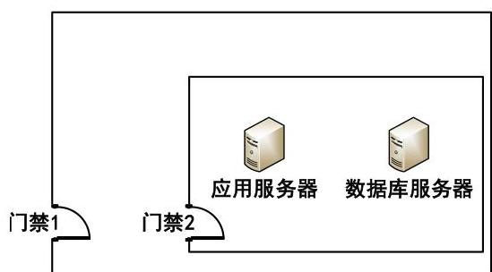
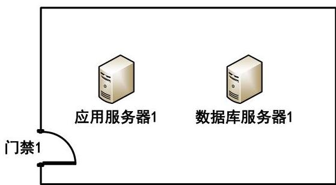
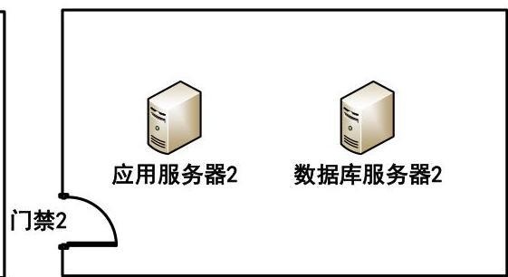

## 一、通用类

### 1. 信息系统密码应用基本要求的等级

**背景：**
GB/T 39786-2021《信息安全技术 信息系统密码应用基本要求》对信息系统密码应用划分为自低向高的五个等级，参照 GB/T 22239 的等级保护对象应具备的基本安全保护能力要求，提出密码保障能力逐级增强的要求，用一、二、三、四、五表示。其中，从密码算法、密码技术、密码产品和密码服务的合规性方面，提出了第一级到第五级的密码应用通用要求，从信息系统的物理和环境安全、网络和通信安全、设备和计算安全、应用和数据安全四个技术层面提出了第一级到第四级的密码应用技术要求，并从管理制度、人员管理、建设运行和应急处置四个方面提出了第一级到第四级的密码应用管理要求。

#### 1.1 问题：如何确定被测信息系统密码应用等级？

**解答：**
GB/T 39786-2021 中的密码应用等级一般由网络安全等级保护的级别确定。信息系统根据 GB/T 22240-2020《信息安全技术 网络安全等级保护定级指南》确定等级保护级别时，同步对应确定密码应用等级，即等保定级为第一级的网络与信息系统应遵循 GB/T 39786-2021 第一级密码应用基本要求，等保定级为第二级的网络与信息系统应遵循 GB/T 39786-2021 第二级密码应用基本要求，以此类推。

#### 1.2 问题：如果新建信息系统在规划阶段尚未完成网络安全等级保护备案工作，被测单位只有一个拟定的信息系统等级，针对此情况如何确定被测信息系统的密码应用等级？

**解答：**
对于未完成网络安全等级保护定级的重要信息系统，优先以被测单位拟定等级开展密评，但应尽量保证拟定等级与后期备案等级的一致性；如果拟定等级低于后期备案等级时，需要按备案等级重新开展密评。对于无拟定等级的重要信息系统，其密码应用等级至少为第三级。需要说明的是，GB/T 39786-2021 只是密码应用基本要求，被测系统有高安全保护需求或高安全标准等特殊情况，信息系统的密码应用等级可以高于等保定级。

#### 1.3 问题：目前，部分系统责任单位由于上级单位或者政策的要求，希望能够尽可能以高安全标准要求来进行信息系统的安全防护，特别是老旧系统。针对网络安全保护等级为二级的信息系统，被测单位希望能以 GB/T 39786-2021 中的第三级密码应用要求进行改造和测评，此时该如何把握？

**解答：**
目前，GB/T 39786-2021 中的密码应用等级一般与网络安全等级保护的级别持平。所以，在信息系统不存在额外密码应用需求的前提下，原则上被测系统密码应用等级的选取与网络安全等级保护的级别保持一致。但是，针对被测单位以高安全标准规划、建设信息系统的密码应用，并希望能够按照 GB/T 39786-2021 中更高密码应用等级进行密评的情形，密评机构在测评前，应在确认该做法符合被测信息系统所属密码管理部门相关要求的前提下，加以确认其密码应用等级是否等于或者高于等级保护备案等级，进而开展测评工作。

### 2. 应、宜、可测评指标把握

**背景：**
GB/T 39786 对密码应用各项指标要求的力度，主要通过“应”“宜”“可”加以区分，具体实施时，需把握哪些是必须实现的、哪些是可以自行把握的。在“应”“宜”“可”三个指标中，“可”和“应”的含义明确，但“宜”含义，在 GB/T 39786 中有其特殊性。

**问题：在密评实施中，如何理解和把握“宜”的指标要求？**

**解答：**
依据 GM/T 0115《信息系统密码应用测评要求》，据信息系统的密码应用方案和方案评估报告/评审意见，决定是否将“宜”的指标要求纳入标准符合性测评范围，具体如下：
(1) 若信息系统未编制密码应用方案或在方案中未对“宜”的指标要求做明确说明，则“宜”的指标要求纳入标准符合性测评范围。
(2) 若信息系统编制了密码应用方案，且方案通过评估，方案中明确了不适用的“宜”的指标要求项，且有对应的风险控制措施说明的情况下。密评人员在测评时，应根据信息系统的密码应用方案和方案评估报告/评审意见，核实方案中的不适用指标要求项所采用的风险控制措施的适用条件，在实际的信息系统中是否被满足，且信息系统的实施情况与方案中所描述的风险控制措施是否一致，若满足适用条件，该测评指标为“不适用”；若不满足适用条件，则应纳入标准符合性测评范围，进行测评和结果判定。

### 3. 具有认证证书的商用密码产品对应的模块等级

**背景：**
在信息系统中密评时，使用的商用密码产品对应的认证证书分为两种，一种是认证证书上会标注有此密码产品对应的密码模块安全等级，一种是认证证书没有标注有密码产品对应的密码模块安全等级。

**问题：未标注密码模块安全等级的商用密码产品在测评时如何判定？**

**解答：**
根据国家密码管理局和市场监管总局联合发布的《关于调整商用密码产品管理方式的公告》（第39号），自2020年7月1日起，已发放的《商用密码产品型号证书》自动失效，对有效期内的《商用密码产品型号证书》，持证单位可于2020年6月30日前，自愿申请转换国推商用密码产品认证证书，经认证机构审核符合认证要求后，直接换发认证证书，认证证书有效期与原《商用密码产品型号证书》有效期保持一致。

在实际测评时，未标注密码模块安全等级的产品可分以下两种情况：
* 对于换证的密码产品，因为其换发的认证证书上一律没有标注密码模块安全等级，此时需要密码厂商进一步提供换证前的商用密码产品型号证书，如果商用密码产品型号证书中标注了其符合的密码模块等级，则按此等级进行判定；否则，按“密码产品符合一级密码模块”进行判定。
* 对于新发认证证书的密码产品，市场监管总局和国家密码管理局发布的《商用密码产品认证目录》明确规定了密码模块标准适用的密码产品种类，其他种类产品（如安全芯片，密码系统类产品等）则不依据密码模块标准进行检测和认证。

### 4. 经认证合格的密码产品的产品合规性、密钥安全符合性的判定要点

**背景：**
GM/T 0115《信息系统密码应用测评要求》的通用测评要求中，提出了“5.2 密钥管理安全性”测评要求，其指标主要涉及密码产品/服务相关的内容；“5.3 密码产品合规性”测评要求，在一些特殊情形下的判定要点。

#### 4.1 问题：在密评时，会发现商用密码产品认证证书过期的情况，即密评开展的时间在密码产品认证证书有效日期之后，而且产品厂商又提供不出更新后的认证证书，针对这种情况该如何判定密码产品的合规性？

**解答：**
如无特殊情况和安全风险，密码产品的采购合同签订时间如果在商用密码产品认证证书的有效期内，则可判定为产品合规。此外，在测评过程中，如果密评人员发现密码产品依据的相关密码标准已经失效或更新，则有义务告知信息系统单位相关情况，并建议其选用依据最新标准的密码产品。

#### 4.2 问题：有些类型的密码产品部署模式为客户端与服务端共同作用，实现密码技术的应用。例如，VPN 等密码产品存在客户端和服务端的情况，在测评时应如何判断实际部署中涉及客户端的密码产品的合规性？

**解答：**
针对此种情况，可分以下三步依次执行测评实施，综合判定产品的合规性。
1.  **一是确认商用密码产品认证证书中的内容是否包括客户端和服务端。** 通过查看认证证书确定密码产品中是否包括客户端和服务端，还是仅为其一。若无法根据认证证书直接确定，则还需要厂商配合提供密码产品的认证证书对应的检测报告，以进一步确定。
2.  **二是确认被测系统中部署的密码产品与送检产品密码边界的一致性。** （注：这一步主要考虑的情形是认证证书中标明了密码产品包含客户端和服务端。若客户端和服务端本身为两个独立的经检测认证合规的密码产品，则直接分别判定产品合规性即可，此处不再赘述）。根据认证证书和认证证书对应的检测报告，除了确认服务端的一致性之外，如果密码产品包含客户端且对客户端有安全要求，也需要核查客户端与实际产品的一致性。原则上应确保实际部署的密码产品与送检产品的密码边界是一致的，且部署产品版本与送检产品版本一致或高于送检版本（版本迭代升级原因仅为 bug 修订，必要时需厂商提供变更说明）。如果不一致，则可考虑根据实际密码应用需求及密码使用情况等因素，对产品合规性进行分析判定。例如，送检产品包含安全浏览器和 SSL VPN 网关，实际部署时改为通用浏览器和 SSL VPN 网关，则根据实际密码应用需求进行判定，如仅需实现对服务端的单向鉴别，则测评时重点核查服务端的密码产品合规性，同时核查浏览器是否配套实现了对应的 SSL 协议套件。
3.  **三是确认被测系统中部署的密码产品实现的密码功能与送检产品密码功能的一致性。** 需结合认证证书对应的检测报告，确认被测系统密码应用方案中所描述的拟使用的产品密码功能或被测系统实际使用时所调用的产品密码功能，与送检产品所提供的密码功能的一致性。

#### 4.3 问题：如何确定密码产品的密码功能边界，例如，签名验签服务器实现了加解密功能，在测评时如何判定其合规性？

**解答：**
这里只针对签名验签服务器实现了加解密功能进行解答。
签名验签服务器是在 GM/T 0018-2012《密码设备应用接口规范》的基础上，对服务器密码机进一步封装，以实现签名验签功能。签名验签服务器在产品检测时，依据 GM/T 0029《签名验签服务器技术规范》和 GM/T 0028《密码模块安全技术要求》进行检测，除了检测签名验签服务器的签名验签功能外，也检测各算法的加解密功能、性能。因此，只要认证产品的安全等级符合要求且实际测评时确认了和送检产品密码功能的一致性，则使用签名验签服务器进行加解密密码应用时可以把签名验签服务器视为合规的密码产品。

#### 4.4 问题：经认证合格的密码产品，《信息系统密码应用测评要求》中“5.2 密钥管理安全性”测评是否可以直接判定为“符合”？

**解答：**
不能直接判定为“符合”。信息系统采用经认证合格的密码产品仅仅是密钥管理安全性判定为“符合”的必要条件，还应当对以下内容进行核查：
(1) 该密码产品的安全级别是否满足 GB/T 39786 相应等级的要求，如 GB/T 39786 第三级的信息系统应当采用满足 GB/T 37092 第二级及以上安全要求的密码产品；
(2) 如果被测系统有密码应用方案，应核查系统密钥管理机制是否与方案一致；如果被测系统无密码应用方案，应分析其密钥体系设计是否合理、实现是否正确；
(3) 当密码产品产生的密钥在该密码产品外部进行管理时，是否进行了相应保护，如密钥在外部数据库中存储/备份/归档时是否进行了机密性和完整性保护；
(4) 该密码产品是否按照产品配套的安全策略文档进行部署和使用，信息系统的密钥管理制度是否能够保证该密码产品被正确地部署和使用等。

### 5. 通过代码实现数据机密性、完整性保护的判定方法

**背景：**
GB/T 39786《信息安全技术 信息系统密码应用基本要求》在 8.4 节中要求“d) 宜采用密码技术保证信息系统应用的重要数据在传输过程中的机密性；e) 宜采用密码技术保证信息系统应用的重要数据在存储过程中的机密性；f) 宜采用密码技术保证信息系统应用的重要数据在传输过程中的完整性；g) 宜采用密码技术保证信息系统应用的重要数据在存储过程中的完整性”。实际测评过程中，发现用户可能使用开源代码的密码运算功能对重要数据实现机密性保护、完整性保护，未使用经认证的商用密码产品。

**问题：未使用密码产品，通过开源或自行开发的代码以软件实现密码算法的方式进行数据机密性、完整性保护，结果怎么判定？是否存在高风险？**

**解答：**
依据 GB/T 39786-2021《信息安全技术 信息系统密码应用基本要求》和 GM/T 0115-2021《信息系统密码应用测评要求》，被测系统采用的密码产品应符合相应等级的密码模块安全要求。对于自研软件实现数据机密性和完整性保护且无法提供任何安全性证明的情况，由于无法判断其密码模块安全等级，而且其采用的密码算法或技术实现安全性以及软实现带来的密钥管理安全性均无法保证，因此判定为“不符合”；对于使用第三方开源密码库实现数据机密性和完整性保护的情况，如果第三方开源密码库是经过长期使用且没有暴露出安全问题的，且正确地使用开源密码库，则可以考虑根据实际核查结果酌情判定为“部分符合”，并给予相应分数。

### 6. 组合密码算法的量化评估和风险判定

**背景：**
组合使用密码算法实现数据安全保护时，针对该情形的量化评估和风险判定。

**问题：有些数据的传输或存储保护，存在组合使用密码技术实现的情形，如使用 DES 算法对数据变换后，再使用 SM4 算法对 DES 加密后的密文进行变换，即 SM4(DES(data))，应如何进行量化评估和风险判定？**

**解答：**
由于加密算法的安全强度和算法复杂度、参数规模（密钥长度、分组长度等）等相关，当加密算法组合使用时，只要某一层加密算法安全强度足够，且组合算法不使用同一密钥，那么被保护数据就是安全的（其他弱算法的运算可类似看成“未对明文做安全保护”）。因此，当加密算法组合使用时，量化评估和风险判定结果均依据安全强度较高的算法而定。
另外，由于算法安全强度和密钥管理、算法实现正确性有关，因此在进行相应测评对象的风险判定时还需综合 DAK 判定情况进行分析评价。

### 7. 如何开展分期规划、改造的信息系统的密码应用安全性评估

**背景：**
在进行信息系统密评时发现，被测信息系统有通过评估的密码应用方案，且方案中明确了该系统是分期做密码改造。例如，由于经费原因，应用和数据安全层面的身份鉴别指标不做改造但给出了合理的风险缓解措施，且明确在二期建设中进行改造并给出改造的密码应用解决方案。在被测系统按照密码应用方案一期建设要求完成建设后，开展密评。

**问题：针对上述情况，在信息系统按密码应用方案完成一期建设后开展密评时，该如何确定测评范围？**

**解答：**
对于密码应用方案中涉及分期密码改造的情况，在实际测评时，应根据系统定级范围和密码应用需求选取所有适用的测评指标和测评对象开展系统密评并给出评估结论，即测评指标和测评对象的选取范围与该系统是否进行分期密码改造无关。

### 8. 已有通过评估的密码应用方案，在实际密评时的注意事项

**背景：**
按照密评管理办法及相关管理要求，网络与信息系统运营者在系统规划阶段完成密码应用方案评估，在建设和运行阶段完成系统密评。

**问题：针对密码应用方案已经通过评估的信息系统，在密评时发现实际情况不一致，如何处理？**

**解答：**
密码应用方案评估是在信息系统规划阶段，对所编制的密码应用方案（或密码改造方案）进行评估。建成或已运行的信息系统的密码应用情况是否与规划阶段的一致，需要在系统密评阶段（包括初次密评和定期密评）进行核实、验证，因此在实际开展系统密评工作时，可参考通过评估的密码应用方案等文件了解系统业务和密码应用情况。
如果在测评时发现实际建设情况与密码应用方案不一致，则需要系统运营者提供密码应用方案修订或优化的证明材料，但同时应按实际测评时掌握的信息为准，并以实际情况得出测评结果。

---

## 二、密码应用技术类

### (一) 物理和环境安全

### 9. 物理和环境安全层面的测评对象识别和确定

**背景：**
GB/T 39786《信息安全技术 信息系统密码应用基本要求》在 8.1 节中要求“a) 宜采用密码技术进行物理访问身份鉴别，保证重要区域进入人员身份的真实性；b) 宜采用密码技术保证电子门禁系统进出记录数据的存储完整性；c) 宜采用密码技术保证视频监控音像记录数据的存储完整性”。相应的，GM/T 0115《信息系统密码应用测评要求》在“6.1 物理和环境安全”中规定该安全层面的测评对象包括信息系统所在机房等重要区域及其电子门禁系统和视频监控系统。

#### 9.1 问题：如何确定该层面的测评对象？对于系统部署在非被测系统单位管辖范围之内的情况，如运营商机房、云服务提供商机房、其他单位或部门管辖的机房等，在物理和环境安全层面应如何判定该指标的适用性？如何开展密评？

**解答：**
物理和环境安全层面的测评对象为被测信息系统所在的物理机房，具体为物理机房的电子门禁系统和视频监控系统。
如果被测信息系统所在的物理机房采用多区域部署或被测信息系统重要资产分布在不同的物理机房中，那么针对该信息系统涉及的所有物理机房均应作为测评对象进行测评，密评人员需现场取证。

针对被测信息系统部署在被测系统单位管辖范围之外的情况，物理和环境安全层面仍然适用，即需要针对该安全层面进行测评。
1.  如果被测信息系统所在的 IDC 机房、运营商机房或云服务提供商机房等经历过商用密码应用安全性评估且相应系统评估结果为“符合”或“基本符合”，则可以复用商用密码应用安全性评估报告中“物理和环境安全”层面的相关测评结论。特别地，如果云平台通过了商用密码应用安全性评估，并且级别不低于云上应用系统的网络安全保护等级时，则云上应用系统（与云平台处于同一物理机房）的物理和环境安全层面可以复用云平台相应的测评结论。
2.  如果被测信息系统所在的 IDC 机房、运营商机房或云服务提供商机房等未经历过商用密码应用安全性评估或经历过的相应系统评估结果为“不符合”，则密评人员需现场取证；对于条件不允许的情况，可以通过系统建设方或租赁方要求 IDC 机房或云服务提供商机房等的运维方提供相关说明文件和证据以支撑测评结论。

#### 9.2 问题：当被测信息系统的机房采用多层门禁措施，且不同门禁采取的物理访问身份鉴别机制不一致时，例如外层门禁采用非密码技术，而内层门禁采用经检测认证合格的安全门禁系统实现，则物理和环境安全层面的“身份鉴别”指标该如何选择测评检查点？

**解答：**
针对此情况需要考虑多层电子门禁系统的保护范围。如果信息系统所有的受保护对象都在多层门禁的保护范围之内，则可在多层门禁系统中选择密码应用最合规、正确、有效的进行测评，但要注意多层门禁之间的物理区域存在非授权人员访问情形。如果存在某个受保护对象只在最外层电子门禁系统的保护下，那么应该以最外层的电子门禁系统作为测评对象。如果受保护对象在多个电子门禁系统的保护下，那么所有提供保护的电子门禁系统都需要测评。

**图 9-1 多重保护**

**图 9-2 分布在多层门禁中**

**图 9-3 分布在多个门禁中**

在上述示例中：
* 图 9-1 中，可选择一个密码应用最合规、正确、有效的门禁进行测评，测评过程中两个门禁中有一个满足测评要求即可。但是同时要注意，如果门禁1与门禁2之间物理区域还有非授权人员可以访问的话，则必须对门禁2测评；而外层门禁可能会起到安全加固和安全风险缓解作用，密评机构需根据实际情况进行确认。
* 图 9-2 中，应选择门禁1测评。
* 图 9-3 中，门禁1和门禁2都需要测评。

### 10. 电子门禁记录数据存储完整性测评时的注意事项

**背景：**
一些信息系统所在机房已经部署合规的电子门禁系统，厂商也声称机房进出记录受到完整性保护。

**问题：对于符合 GM/T 0036-2014《采用非接触卡的门禁系统密码应用技术指南》标准的电子门禁系统，其门禁系统内置的进出记录数据存储的完整性保护是否可以直接采信产品检测结果，如不可直接采信，是否需要门禁系统厂商提供其他证据？**

**解答：**
由于 GM/T 0036 中规定的相关要求，主要针对的是采用基于非接触式卡的门禁系统对机房进出人员身份鉴别这一场景，因此，对门禁系统进行密评实施时，按照密评相关标准，需要相关密码厂商提供门禁系统进出记录数据存储完整性保护的相关证据，并提供实现该密码应用的密码产品检测认证合规性的证明。

### (二) 网络和通信安全

### 11. 网络和通信安全层面的测评对象识别与确定

**背景：**
信息系统一般通过网络技术来实现与外界的互联互通，GB/T 39786《信息安全技术 信息系统密码应用基本要求》规定了信息系统在网络和通信安全层面的密码应用技术要求，这些要求涉及到通信的主体（通信双方）、信息系统与网络边界外建立的网络通信信道，以及提供通信保护功能的设备、组件和产品。

#### 11.1 问题：如何确定网络和通信安全层面的测评对象？

**解答：**
网络和通信安全层面的测评对象主要是针对跨网络访问的通信信道，这里的跨网络访问指的是从不受保护的网络区域访问被测系统。
可以从通信主体和网络类型两个方面来确定网络和通信安全层面的测评对象：
(1) 网络类型：这里主要依据网络之间是否相对独立进行分类，如互联网、政务外网、企业专网等；
(2) 通信主体：指的是参与通信的各方，典型的如客户端与服务端。例如，PC 机上运行的浏览器与服务器上运行的 web 服务系统，移动智能终端上运行的 APP 与服务器上运行的应用系统；也可以是服务端与服务端，例如，IPSec VPN 与 IPSec VPN 之间。

**【场景示例】**
下面以一个具体场景来描述测评对象的确定过程。
在一个信息系统中，通常应用包括前台应用系统和后台管理系统；系统运行的网络环境通常包括互联网、政务外网和办公内网，其中，办公内网也属于政务外网。该信息系统网络通信情况描述如下。
(1) 用户可以从互联网、政务外网、办公内网，使用非国密浏览器或国密浏览器通过 HTTPS 协议访问前台应用系统；
(2) 管理员可以从办公内网或使用 VPN 客户端通过内网 SSL VPN 接入办公内网后，再使用国密浏览器通过 HTTPS 协议访问后台管理系统；
(3) 系统管理员可以从互联网先登录运维 SSL VPN 后，再通过堡垒机对服务器、密码产品等设备进行运维；
(4) 信息系统可以通过 IPSec VPN 调用外部的密码资源（例如政务外网的数据加密服务）。

针对此场景，根据通信主体，梳理出对应的网络类型，形成以下表格：

| 服务端 / 客户端 | 前台应用系统 | 后台管理系统 | 内网 SSL VPN | 运维 SSL VPN | IPSec VPN |
| :--- | :--- | :--- | :--- | :--- | :--- |
| **国密浏览器** | 互联网、政务外网 | 办公内网 | | | |
| **非国密浏览器** | 互联网、政务外网 | | | | |
| **VPN客户端** | | | 政务外网 | 互联网 | |
| **IPSec VPN** | | | | | 政务外网 |

根据上述表格描述，即可确定此信息系统网络和通信安全层面的测评对象。表中的每个元素表示通信主体可在某种网络类型下进行通信。由此可确定的测评对象如下：

| 序号 | 测评对象 | 描述 |
| :--- | :--- | :--- |
| 1 | 互联网国密浏览器与前台应用系统之间的通信信道 | 用户从互联网使用国密浏览器通过 HTTPS 协议访问前台应用系统，密码应用主要测评 HTTPS 协议。 |
| 2 | 政务外网国密浏览器与前台应用系统之间的通信信道 | 用户从政务外网使用国密浏览器通过 HTTPS 协议访问前台应用系统，密码应用主要测评 HTTPS 协议。 |
| 3 | 互联网非国密浏览器与前台应用系统之间的通信信道 | 用户从互联网使用非国密浏览器通过 HTTPS 协议访问前台应用系统，密码应用主要测评 HTTPS 协议。 |
| 4 | 政务外网非国密浏览器与前台应用系统之间的通信信道 | 用户从政务外网使用非国密浏览器通过 HTTPS 协议访问前台应用系统，密码应用主要测评 HTTPS 协议。 |
| 5 | 政务外网 VPN 客户端与内网 SSL VPN 之间的通信信道 | 管理员用户从政务外网通过内网 SSL VPN 接入办公内网，密码应用主要测评 SSL VPN 协议。 |
| 6 | 办公内网国密浏览器与后台管理系统之间的通信信道 | 管理员从办公内网使用国密浏览器通过 HTTPS 协议访问后台管理系统，密码应用主要测评 HTTPS 协议 |
| 7 | 互联网 VPN 客户端与运维 SSL VPN 之间的运维通信信道 | 系统管理员从互联网访问 SSL VPN 运维设备，密码应用主要测评 SSL VPN 协议。 |
| 8 | 政务外网 IPSec VPN 与 IPSec VPN 之间的通信信道 | 信息系统从政务外网通过 IPSec VPN 调用外部密码资源，密码应用主要测评 IPSec VPN 协议。 |

#### 11.2 问题：当被测系统使用第三方电子认证服务机构提供的认证服务完成系统功能时，被测系统与第三方电子认证服务相关系统之间的通信信道是否需要纳入测评范围？

**解答：**
如果被测系统与第三方电子认证服务相关系统之间的通信信道经过了不可控的网络环境（比如互联网等），该条通信信道应该纳入“网络和通信安全”层面的测评对象进行测评。

#### 11.3 问题：若被测系统为独立的内网系统，且不允许跨网络边界进行远程运维，这种情况下在网络和通信安全层面是否可认为没有测评对象？

**解答：**
这类情况下还需要确定网络边界环境及网络内部的安全性,再行决定。
网络和通信安全层面的测评对象的选择，不仅仅以系统属于的网络环境是内网还是外网进行区分，应以系统所在的网络边界环境，以及网络内部通信是否安全作为网络和通信层面是否需要测评的标准。

#### 11.4 问题：针对双活机房之间通信的通信链路，是否可作为网络和通信层面的一条通信信道？

**解答：**
因重要业务数据、重要个人信息等数据会在双活机房之间进行传输，双活机房之间的通信链路无论是通过运营商专线还是采用物理裸光纤进行数据通信，均应将该通信信道作为测评对象并参照 GM/T 0115《信息系统密码应用测评要求》进行测评。
对于双活机房之间的通信链路是物理传输的裸光纤的情况，若不将该通信信道作为网络和通信安全层面的测评对象，则应在密码应用方案中详细说明该通信链路的实际情况并经自行评估或密评机构审定后按实际情况处理。其中，通信链路的实际情况包括但不限于自建或租用情况、传输数据的方式、传输数据的内容、链路的物理位置和节点受控情况等。

#### 11.5 问题：跨网络边界的系统之间的交互，如果通信主体不在其责任范围之内，例如，被测系统与外部系统通过前置机建立通信信道，前置机部署在被测系统内且不归属于被测系统责任单位，此通信信道是否需要纳入测评范围？比如医保系统与银行系统有业务往来，医保系统外联出口处放置银行前置机，作为与银行系统交互的中间设备，银行前置机与银行系统之间搭建了通信信道。

**解答：**
跨网络边界的系统之间的交互所搭建的通信信道，无论通信主体是否属于被测系统，该通信信道都应纳入“网络和通信安全”层面的测评对象进行测评。
比如医保系统与银行系统有业务往来，医保系统前放置银行前置机，由银行前置机跟医保系统交互，再由银行前置机与银行系统搭建通信信道。

**图 11-1 存在系统间通信信道的场景**

该图中，银行前置机归属于银行系统责任单位，则在测评医保系统时，在“网络和通信安全”层面也需要测评“系统间的通信信道”。

### 12. 网络和通信安全层面的身份鉴别

**背景：**
SSL VPN 安全网关除了支持符合国家或密码行业标准要求的安全传输服务以外，往往也支持基于国外密码算法的安全传输服务。很多应用系统往往会使用通用浏览器和 SSL VPN 安全网关相搭配的安全传输服务。

**问题：采用合规的 SSL VPN 安全网关，但安全通道使用安全强度足够高的国外密码算法套件，且客户端采用通用浏览器，此时网络和通信安全层面的“身份鉴别”指标该如何进行量化评估？**

**解答：**
针对网络和通信安全层面的“单向身份鉴别”，由于考虑到客户端不需要对私钥进行密钥管理（无私钥参与密码运算的需求），因此量化评估中 D、A、K 最高可为 D(√)、A(×)、K(√)；针对网络和通信安全层面的“双向身份鉴别”，由于在客户端需要进行私钥运算，如果采用的是通用浏览器，密钥管理上存在安全问题，因此 D、A、K 最高可为 D(√)、A(×)、K(×)。

### 13. 网络层安全接入认证和身份鉴别指标的差别

**背景：**
GB/T 39786-2021《信息安全技术 信息系统密码应用基本要求》在 8.2 节中要求 e) 可采用密码技术对从外部连接到内部网络的设备进行接入认证，确保接入的设备身份真实性。

**问题：如何理解“可采用密码技术对从外部连接到内部网络的设备进行接入认证，确保接入的设备身份真实性”安全接入认证和身份鉴别如何进行区分？**

**解答：**
“身份鉴别”指标适用于两个实体通过不可控的网络（比如互联网）进行通信之前进行的身份鉴别，比如 IPSec VPN 或者 SSL 客户端/服务器的场景，IPSec VPN 之间或者 SSL 客户端和服务端之间的鉴别都属于“身份鉴别”指标的测评范围。
“安全接入认证”指标适用于设备“物理地”从外部接入信息系统的内部网络之前对设备的身份鉴别，接入后，该设备将成为信息系统内部网络的一部分。比如智能手持移动终端设备接入信息系统网络的场景，对于移动智能终端设备接入的认证属于“安全接入认证”指标的测评范围，该类终端设备经认证接入信息系统网络后则成为网络内的一部分。

### (三) 设备和计算安全

### 14. 设备和计算安全层面的测评对象识别与确定

**背景：**
GM/T 0115《信息系统密码应用测评要求》在设备和计算层面的测评对象包括：通用设备（及其操作系统、数据库管理系统）、网络及安全设备、密码设备、各类虚拟设备以及提供相应密码功能的密码产品。

**问题：如何确定设备和计算安全层面的测评对象？**

**解答：**
设备和计算层面的测评对象主要包括通用服务器（如应用服务器、数据库服务器）、数据库管理系统、整机类和系统类的密码产品、堡垒机（当系统使用堡垒机用于对设备进行集中管理时，不涉及应用和数据安全层面）等。
交换机、网闸、防火墙、WAF 等未使用密码功能的网络设备、安全设备一般不作为设备和计算安全层面的测评对象。需要注意若存在管理通道跨越边界的情况，需在网络和通信安全层面梳理一条远程管理数据传输通道作为测评对象。
建议在密评报告中，对设备和计算层面的测评对象进行分类整理和描述。至少分为密码产品/设备、具有密码功能的网络及安全设备、采用密码技术的其他产品、通用设备、不具有密码功能的网络及安全设备、虚拟设备和系统。

### 15. 设备和计算安全层面测评对象选取粒度

**背景：**
设备和计算安全层面的测评对象为通用服务器（如应用服务器、数据库服务器）、数据库管理系统、整机类和系统类密码产品、堡垒机等。在一些较大型信息系统中，针对上述每一类测评对象，普遍均会部署多台设备。

**问题：如何确定设备和计算安全层面的各个测评对象选取的粒度？**

**解答：**
* **针对通用服务器和堡垒机**，以“具有相同硬件、软件配置的设备”为粒度确定测评对象，即具有相同硬件配置（如生产厂商、型号等）和软件配置（如操作系统版本、中间件等）的服务器/堡垒机作为一个测评对象。对通用服务器、堡垒机类的测评对象进行量化评估时，D/A/K 均以各测评对象所包含的各个设备的实际应用情况的最低分值赋分。
* **针对整机类密码产品**（如 IPSec VPN 网关、SSL VPN 网关、安全认证网关、数据密码机、服务器密码机、签名验签服务器、时间戳服务器、云服务器密码机等）、**系统类密码产品**（如动态令牌认证系统、证书认证系统、证书认证密钥管理系统等），以“具有相同商用密码产品认证证书编号的密码产品”为粒度确定测评对象。对密码产品类测评对象进行量化评估时，D/A/K 均以各测评对象所包含的各个整机类的密码产品或系统类密码产品的实际应用情况的最低分值赋分。

### 16. 设备和计算安全层面的身份鉴别

**背景：**
某些信息系统只能在本地进行设备登录运维，但是设备部署在相对安全的机房内部。由于设备改造难度较大，难以对设备的登录机制进行整改。

#### 16.1 问题：仅进行本地运维的设备，如何针对设备和计算安全层面的“身份鉴别”和“远程管理通道安全”该如何进行测评和结果判定。

**解答：**
测评机构需要首先核实设备确实仅进行本地运行，关闭了对外运维的接口。核实后，该测评对象的“远程管理通道安全”测评指标可作为不适用项，“身份鉴别”测评指标为适用项。
在对“身份鉴别”测评指标进行测评时，若本地运维均未采用密码技术对登录设备的用户进行身份鉴别，或用户身份真实性的密码技术实现机制不正确或无效，则该测评对象的测评结果为不符合。进一步地，对于不符合的情况，如果信息系统采用了必要的缓解手段（如《信息系统密码应用高风险判定指引》文件中所描述的采用基于特定设备或生物识别技术保证用户身份的真实性），又或是将仅支持本地管理的被运维设备单独安置在具有良好安防措施的密闭区域（如机柜）内且仅有设备运维人员才有该区域的访问权限，可酌情降低风险等级。

#### 16.2 问题：设备和计算安全层面，如果信息系统通过堡垒机统一运维管理设备，堡垒机及其被运维设备的身份鉴别指标如何进行判定？

**解答：**
在合规性判定方面，各设备的身份鉴别应分开判定，例如，堡垒机采用动态令牌系统登录，使用用户名+口令登录应用服务器等被运维的设备，则堡垒机的身份鉴别可判定为符合，但被运维设备的身份鉴别应判定为不符合。
在风险判定方面，遇有以下情况可以酌情降低风等级：
(1) 直接通过堡垒机运维，如果堡垒机的身份鉴别指标的测评结论为“符合”或“部分符合”，并且没有高风险，则通过堡垒机进行统一管理的设备，其身份鉴别可视为采取了风险缓解措施；
(2) 通过 VPN 保护运维通信信道，同时满足以下条件则堡垒机及其被运维的设备，其身份鉴别可视为采取了风险缓解措施：
    a. VPN 是运维专用的安全网关，运维人员也无法绕过安全网关进行设备远程运维管理（如堡垒机仅对 VPN 地址开放远程管理端口并限制堡垒机从本地登录）；
    b. VPN 客户端与安全网关之间的通信信道采用密码技术进行通信实体双向身份鉴别，并且在对客户端鉴别时须使用运维人员所持智能密码钥匙等存有身份鉴别信息的硬件介质进行实现（需注意每次设备运维时须重新建立 VPN 连接）；或者，运维人员登录 VPN 设备进入内网时采用动态口令机制、基于对称密码算法或密码杂凑算法的消息鉴别码 (MAC) 机制、基于公钥密码算法的数字签名机制等密码技术对登录用户进行身份鉴别并且机制正确、有效。

### 17. 远程管理通道安全的测评要点

**背景：**
GM/T 0115《信息系统密码应用测评要求》在网络和通信层面的测评对象为“信息系统与网络边界外建立的网络通信信道，以及提供通信保护功能的设备或组件、密码产品”，设备和计算层面“远程管理通道安全”测评项要求系统实现“远程管理设备时，采用密码技术建立安全的信息传输通道”。

**问题：设备和计算安全层面“远程管理通道安全”测评项如何避免与网络和通信安全层面的测评对象重复测评，如何进行量化评估？**

**解答：**
以管理员在互联网通过 SSL VPN 接入系统内网后，登录堡垒机对设备进行远程管理为例。
* **网络和通信安全层面**：只有当远程管理通道跨越网络边界时才将其作为该层面测评对象。针对在互联网访问 SSL VPN 接入内网后通过堡垒机对设备进行管理的情况，网络和通信安全层面仅需要测评由管理员在互联网访问 VPN 的过程。
* **设备和计算安全层面**：仅测评与测评对象直接相连的信息传输通道。测评对象为堡垒机时，无需测评管理员在互联网通过 VPN 接入系统内网的过程，仅需测评接入内网后访问堡垒机的信息传输通道，如访问堡垒机管理应用时使用的 HTTPS 协议的密码应用情况；测评对象为通用服务器时，测评内容为通过堡垒机对设备进行管理的信息传输通道，如访问设备时使用的 SSH 协议的密码应用情况。

### 18. 合规密码产品的设备层身份鉴别、完整性相关指标的判定

**背景：**
通常情况下，信息系统责任单位通过部署密码产品以实现各项密码应用，信息系统责任单位只能通过密码产品的外部接口、系统配置界面等实现相应的密码应用，无法对密码产品内部的系统访问控制信息完整性、日志记录完整性、重要可执行程序完整性与来源真实性进行修改。

**问题：合规密码产品的“身份鉴别”“系统资源访问控制信息完整性”“日志记录完整性”“重要可执行程序完整性、重要可执行程序来源真实性”等设备和计算安全层面的指标，应该如何测评？**

**解答：**
在确认密码产品具有合格的商用密码产品认证证书，且可以确定实际部署的密码产品与获认证产品一致的情况下：
* 针对**安全等级二级及以上的密码产品**，在设备和计算安全层面的“系统资源访问控制信息完整性”“日志记录完整性”“重要可执行程序完整性、重要可执行程序来源真实性”这三个指标，可判定为符合。
* 针对**安全等级一级的整机类密码产品**，如确认未采用带密钥的核准密码技术实现时，上述三个指标可判定为部分符合。
* 针对整机类密码产品的“**身份鉴别**”指标不能直接判定为符合，还需要进一步实地查看密码产品是否采用了密码技术（如智能 IC 卡、智能密码钥匙、动态口令等）、是否按照密码产品使用要求对登录设备的用户等进行身份鉴别。
* 对于**系统类密码产品**，其软件部分所在服务器和所含整机类密码产品应分别作为设备和计算安全层面的测评对象，并单独实施测评。
* 对于没有“商用密码产品认证证书”而仅具有“密码检测证书”的密码产品，同样依据相关标准通过了检测，是经过国家密码管理部门认可的，在具体密评判定时，将其视同具有“商用密码产品认证证书”。

### (四) 应用和数据安全

### 19. 应用和数据安全层面的测评对象识别与确定

**背景：**
GM/T 0115《信息系统密码应用测评要求》在应用和数据层面的测评对象为“业务应用以及重要数据”。

#### 19.1 问题：如何确定应用和数据安全层面的测评对象？

**解答：**
应用和数据安全层面的测评对象应包含关键业务应用，具体参考通过评估的密码应用方案设定的范围确定。如无密码应用方案，应根据网络安全等级保护定级报告描述的范围确定。关键业务应用一般情况下应包含被测系统的所有业务应用，关键业务应用中的关键数据一般包含但不限于以下数据：鉴别数据、重要业务数据、重要审计数据、个人敏感信息以及法律法规规定的其他重要数据类型。

#### 19.2 问题：在云应用/平台测评中，密码资源池的密码管理平台应作为应用和数据安全层面的测评对象，还是设备和计算安全层面的测评对象？

**解答：**
密码管理平台是对若干台密码设备的统一调度管理平台，在对云平台密码资源池里的密码设备进行运维管理的同时，建立统一的密码服务接口，面向云平台上的所有应用系统提供密码接口服务，业务逻辑复杂，是云上系统实现密码应用的重要支撑，故应将其作为应用和数据安全层面一个管理类应用系统进行测评。

#### 19.3 问题：某些信息系统通过前端设备采集数据，并且在前端会有存储设备或功能模块收集相关数据，这部分数据是否需要纳入测评范围？

**解答：**
应结合信息系统所在行业关于数据分级的标准和要求，以及信息系统的网络安全等级保护测评报告和密码应用方案（或密码改造方案）进行相关数据重要程度的确定。将所确定的重要数据纳入测评范围，并根据数据实际安全需求开展测评。

#### 19.4 问题：信息系统的关键数据，通常以生产数据和备份数据的形式呈现。信息系统使用了第三方提供的数据异地备份的服务，如备份在第三方提供的异地机房中，备份数据是否纳入测评范围？

**解答：**
备份数据作为生产数据的副本，其密码应用需求与生产数据一致。在测评时，应分别核查原始生产数据和备份数据的密码应用需求是否得到满足。特别地，若采用第三方提供的数据异地备份服务，由于涉及系统间通信，还应注意核查数据备份时跨网络传输的安全性。
在编写密评报告时，通常可考虑将备份数据同生产数据合并处理，作为同一个业务类重要数据体现。

### 20. 应用和数据安全层面的身份鉴别

**背景：**
大量应用系统的身份鉴别使用第三方提供的身份认证服务（此处特指第三方身份认证服务为己单独等保定级的系统）。

**问题：对于此类提供身份认证服务的第三方系统是否要求通过密评后再提供身份认证服务？若该第三方系统未通过密评，是否可以直接认为其应用和数据安全层面的“身份鉴别”指标为不符合？**

**解答：**
* 对于**已通过密评**（“符合”或“基本符合”）的第三方身份认证服务系统，应用和数据安全层面“身份鉴别”指标经过了完整的密码测评，对业务应用系统进行该指标核查时，在确认第三方身份认证服务的有效性后，可复用该指标相关结论；还需对在鉴别机制工作过程中涉及到的重要数据的传输安全性进行延伸测评。
* 对于**未通过密评或未做密评**的第三方身份认证服务系统，在测评业务应用系统时，测评人员应对第三方系统所提供的身份鉴别机制及其鉴别机制工作过程中涉及到的重要数据的传输安全性进行延伸测评。再进一步，如果第三方身份认证系统上保存有应用系统的身份鉴别信息，应对第三方身份认证服务系统上相关的密码应用进行（重新）测评，例如，重要数据存储的机密性和完整性。

### 21. 重要数据机密性、完整性保护的实现方法问题

**背景：**
GB/T 39786-2021《信息安全技术 信息系统密码应用基本要求》的应用和数据安全层面涉及到重要数据的机密性和完整性保护要求。

#### 21.1 问题：对于数据库中的重要数据存储完整性保护，仅使用 SM3 进行保护能否判定为符合？

**解答：**
仅使用 SM3 算法实现数据存储完整性功能，在安全机制方面存在缺陷。入侵者可在篡改数据后，重新进行 SM3 杂凑运算并覆盖原先的杂凑值。因此，应判定为不符合。
建议使用合规的密码产品通过 HMAC-SM3、基于 SM4 的 MAC（参考 GB/T 15852.1-2020）或数字签名的方式实现数据存储的完整性。

#### 21.2 问题：使用经检测认证合格的服务器密码机（符合相应等级的密码模块安全要求）中的 SM4-ECB 算法（密钥管理由服务器密码机完成）对重要数据进行机密性保护，能否判定为符合？

**解答：**
分组密码的 ECB 模式，因其特殊的工作流程，无法隐蔽数据模式（如使用同一个密钥会导致相同的明文分组产生相同的密文分组），也不能抵抗对分组的重放、嵌入、删除等攻击。因此，不推荐在密码应用中使用 ECB 模式，并且在测评时应告知对方安全风险；若有明显安全风险，应进一步敦促其改正以免影响风险判定结果。但在测评判定时，按照目前测评的现行准则，可判定为符合。

### 22. 如何编写涉及应用和数据安全层面的测评内容报告

**背景：**
在《商用密码应用安全性评估报告模板 (2023 版)》中，涉及应用和数据安全层面的测评对象及结果汇总。

**问题：如何编写密评报告中应用和数据安全层面的测评内容？**

**解答：**
(此处以某信息化办公系统为例，提供报告编制案例)

**表 3-7 应用和数据安全测评对象**

| 序号 | 测评对象 | 测评方式 | 说明 |
| :--- | :--- | :--- | :--- |
| 1 | 信息化办公系统应用 | ☑访谈 ☑文档审查 ☑实地查看 ☑配置检查 ☑工具测试 | |

**表 4-4 应用和数据安全测评结果汇总**

| 测评对象序号 | 测评对象 | 身份鉴别 | 访问控制信息完整性 | 重要信息资源安全标记完整性 | 重要数据传输机密性 | 重要数据存储机密性 | 重要数据传输完整性 | 重要数据存储完整性 | 不可否认性 |
| :--- | :--- | :--- | :--- | :--- | :--- | :--- | :--- | :--- | :--- |
| 1 | 信息化办公系统应用 | 部分符合 | 部分符合 | 不适用 | 部分符合 | 符合 | 部分符合 | 部分符合 | 部分符合 |
| **单元测评结果** | | **部分符合** | **部分符合** | **不适用** | **部分符合** | **符合** | **部分符合** | **部分符合** | **部分符合** |

**表 4-5 应用和数据安全身份鉴别测评结果汇总**

| 序号 | 应用用户 | 身份鉴别 |
| :--- | :--- | :--- |
| 1 | OA 办公系统管理员用户 | 部分符合 |
| 2 | OA 办公系统业务用户 | 符合 |
| 3 | 公文管理系统管理员用户 | 符合 |
| 4 | 公文管理系统业务用户 | 符合 |
| **单元测评结果** | | **部分符合** |

**表 4-6 应用和数据安全重要数据测评结果汇总**

| 序号 | 关键数据 | 传输机密性 | 存储机密性 | 传输完整性 | 存储完整性 |
| :--- | :--- | :--- | :--- | :--- | :--- |
| 1 | OA 办公系统管理员用户登录口令 | 不符合 | 符合 | 不符合 | 不符合 |
| 2 | OA 办公系统业务用户登录口令 | 不符合 | 符合 | 不符合 | 不符合 |
| 3 | OA 办公系统业务报表 | 不适用 | 不适用 | 符合 | 符合 |
| 4 | OA 办公系统办公文件数据 | 不适用 | 不适用 | 符合 | 符合 |
| 5 | OA 办公系统业务日志 | 不适用 | 不适用 | 符合 | 符合 |
| 6 | 公文管理系统管理员用户登录口令 | 符合 | 符合 | 不符合 | 不符合 |
| 7 | 公文管理系统业务用户登录口令 | 符合 | 符合 | 不符合 | 不符合 |
| 8 | 公文管理系统业务数据 | 符合 | 符合 | 不符合 | 符合 |
| 9 | 公文管理系统业务日志 | 符合 | 符合 | 不符合 | 符合 |
| **单元测评结果** | | **部分符合** | **符合** | **部分符合** | **部分符合** |

**表 4-7 应用和数据安全不可否认性测评结果汇总**

| 序号 | 操作行为 | 不可否认性 |
| :--- | :--- | :--- |
| 1 | OA 办公系统业务用户文件审批操作 | 部分符合 |
| 2 | 公文管理系统业务用户公文签发操作 | 符合 |
| **单元测评结果** | | **部分符合** |

### (五) 综合

### 23. 访问控制信息的具体含义

**问题：网络和通信安全、设备和计算安全、应用和数据安全等层面提出的访问控制信息指什么？**

**解答：**
* **网络和通信安全层面**：主要包括部署在网络边界的 VPN 中的访问控制列表、防火墙的访问控制列表、边界路由的访问控制列表等进行网络边界访问控制的信息。
* **设备和计算安全层面**：主要包括设备操作系统的系统权限访问控制信息、系统文件目录的访问控制信息、数据库中的数据访问控制信息、堡垒机等第三方运维系统中的权限访问控制信息等。
* **应用和数据安全层面**：主要包括应用系统的权限、标签等能够决定系统应用访问控制的措施等信息。

### 24. 跨网络调用密码资源实现相应密码功能的测评要点

**问题：针对于跨网络边界调用密码资源的情况，在测评时应重点关注哪些问题？**

**解答：**
被测信息系统跨网络边界调用密码资源（如服务器密码机、统一密码服务平台等）时，该调用通道应作为网络和通信安全层面的测评对象进行“身份鉴别”“通信数据完整性”“通信过程中重要数据的机密性”“网络边界访问控制信息的完整性”等指标的测评。
另外，在涉及密码资源调用的技术指标测评时，针对密钥管理安全 (K)，除关注密码产品/密码服务的合规性、密钥生命周期管理机制的安全性外,还应关注具体密码资源调用时的鉴别与访问控制机制，即核实密码资源（如密码服务平台）和具体密码功能是否被授权的合法实体访问和调用。

---

## 三、密码应用管理类

### 25. 缺少密码应用方案的合规性判定

**问题：在依据 GB/T 39786-2021 9.7a) 条款密评时，密码应用方案该如何理解？**

**解答：**
对于已建信息系统，其密码应用方案并不追溯到系统最初规划时的方案，该信息系统根据相关标准、密码应用需求以及前期密评的整改建议，制定的密码应用改造方案可视为该系统的密码应用方案。

### 26. 投入运行前未进行密码应用安全性评估的合规性判定

**问题：被测信息系统为已建运行系统，其建设完成时未进行投入运行前的商用密码应用安全性评估；或者，被测信息系统经密码应用改造后，在重新上线前进行了商用密码应用安全性评估。建设运行层面“投入运行前进行密码应用安全性评估”测评项应如何判定？**

**解答：**
“投入运行前进行密码应用安全性评估”测评指标的合规性判定以密码法实施时间为界限。
(1) 2020 年 1 月 1 日之前投入运行的信息系统：密评时该项可判定为“不适用”；
(2) 2020 年 1 月 1 日之后投入运行的信息系统：如果其建设完成后未进行投入运行前的密码应用安全性评估，则密评时该项判定为“不符合”。
若被测信息系统后期依据通过评估的密码应用方案进行了密码应用改造，在重新投入运行前进行了密码应用安全性评估且评估结论为“符合”或“基本符合”，此时投入运行时间可按照密码应用改造后重新上线的时间进行确定，该项可判定为“符合”。

### 27. 如何开展信息系统密码应用成熟度极低情况下的密码应用管理测评

**问题：针对部分存量信息系统自身密码应用成熟度极低，未部署任何密码产品对其业务进行密码安全防护，而导致密码应用管理方面无法配套建设的情形，在测评时该如何把握？**

**解答：**
针对上述信息系统密码应用成熟度很低的情况，在密评时仍需将 GM/T 0115-2021 中管理制度、人员管理、建设运行和应急处置四个方面纳入测评内容。测评过程中需要进一步考察这四个层面相关制度文件与实际结合情况，如果存在相关制度文件满足指标要求情况，但实际信息系统并未落实密码应用岗位的人员、密码软硬件部署和相应密钥管理等密码应用相关内容时，对应测评单元结果判定时最高为“部分符合”。

---

## 四、量化评估类

### 28. 《量化评估规则(2023版)》中，密码使用有效性 D 项的判定

**问题：被测信息系统在实现其密码应用安全需求时，如果使用了合规产品中存在安全问题或安全强度不足的密码算法（如 DES、MD5 等），密码使用有效性 D 应如何判定和量化？**

**解答：**
当密码技术为满足信息系统安全需求提供了机密性、完整性、真实性和/或不可否认性的保护时被正确、有效使用，则“密码使用有效性 D”可判定为符合。根据《商用密码应用安全性评估量化评估规则 (2023 版)》，在具体量化时，还应进一步考虑密码算法的安全强度，不同安全强度的密码算法在量化评估分值上会有所不同。
* 安全强度大于等于 112 比特的密码算法（如 3DES 使用3个不同密钥、AES-128及以上等）；
* 安全强度大于等于 80 比特小于 112 比特的密码算法（如 RSA-1024、3DES 使用2个不同密钥等）；
* 安全强度小于 80 比特的密码算法（DES、MD5、SHA-1、RSA-512）。

---

## 五、风险判定类

### 29. 有缓解措施的高风险判定

**问题：如果被测系统使用了缓解措施，那么被测系统的风险等级、测评结论、分数是否发生改变？**

**解答：**
如果被测系统使用了相应的缓解措施，并通过评估确认缓解措施有效，原则上可以酌情降低其风险等级，但还应结合被测系统的实际情况进行分析，确认缓解措施能够有效抵御相关威胁，否则仍然维持其风险等级不变。如果因缓解措施导致风险等级发生改变，将可能造成测评结论发生改变，但测评分数仍保持不变。

### 30. 报告中对于高风险缓解措施的体现

**问题：针对测评报告模板中高风险修正过程在哪个地方体现？**

**解答：**
如果测评报告问题涉及高风险判例中的问题场景，则需要在报告附录 A 中，按照实际评估结果进行填写，针对该测评项判定为不符合，但是在风险分析时针对该安全风险进行缓解措施说明。

### 31. 应用层身份鉴别是否可以缓解网络层身份鉴别的高风险

**问题：“网络和通信安全”“应用和数据安全”的身份鉴别指标有何区别？在测评时如何把握两者的关系？**

**解答：**
“网络和通信安全”和“应用和数据安全”的身份鉴别指标的测评对象不同，无法在《商用密码应安全性评估报告模板 (2023 版)》的 5.1 小节进行测评结果修正（也就是无法对测评结果和分值进行“弥补”）。但在风险评估时，仍应当结合其他层面的“身份鉴别”指标测评结果，对本层面的“身份鉴别”指标进行综合考虑。

### 32. 如何理解高风险判定指引中的“适用时”

**问题：在做风险分析和评价时，对于《信息系统密码应用高风险判定指引 (2021)》文件中，部分高风险项的安全问题所提到的“适用时”该如何理解？**

**解答：**
指针对相应指标的密码应用，目前密码产业供给侧存在经检测认证合规的密码产品（即密码产品种类在《商用密码产品认证目录》中）且该密码产品能够满足应用场景实际需求，则视为“适用”。若密评时判定为“不适用”，则须在密评报告的风险分析环节详细论述原因。

---

## 六、特殊场景类

### 33. 云平台测评的责任和范围

**问题：对运行在云平台上的云上应用进行密评时，特别是云平台和云上应用的运营者不同的情况下，如何界定两者的责任和范围。**

**解答：**
(1) 针对云平台自身密码应用的测评（以下简称“云平台测评”），该部分测评的责任主体为云平台的运营者。
(2) 针对云上应用系统密码应用的测评（以下简称“云上应用测评”），该部分测评的责任主体为云上应用的运营者。

### 34. 云平台和云上应用的测评方式和测评结论复用方式

#### 34.1 问题：对运行在云平台上的云上应用进行密评时，那么如何分别对这两个系统进行分别测评，测评结论能够复用吗？

**解答：**
云平台测评结论中须包含“云平台密码支撑能力说明”，分为两类情况：
1.  **被完全评估的支撑能力**：指的是云平台中的某些测评对象，这些测评对象同时用于支撑云平台和云上应用，将同时作为云平台和云上应用的测评对象。
2.  **被部分评估的支撑能力**：指的是云平台提供的某些支撑服务，这些支撑服务仅用于云上应用而不用于云平台，或者将服务于云平台和云上应用的不同测评对象。

**表 34-1 被完全评估的支撑能力说明示例**

| 序号 | 安全层面 | 测评对象 | 可能涉及的指标 | 量化评估分值 | 结果判定 | 风险等级 |
| :--- | :--- | :--- | :--- | :--- | :--- | :--- |
| 1 | 物理和环境安全 | 云平台机房 | 身份鉴别 | 1 | 符合 | |
| 2 | | | 电子门禁记录数据存储完整性 | 0.5 | 部分符合 | 低 |
| 3 | | | 视频监控记录数据存储完整性 | 0.5 | 部分符合 | 低 |
| 4 | | | 身份鉴别 | 0.5 | 部分符合 | 中 |
| 5 | 网络和通信安全 | 云平台异地机房之间的通信信道 | 通信数据完整性、通信过程中重要数据的机密性、网络边界访问控制信息的完整性 | 1 | 符合 | A |
| 6 | | 云服务客户业务应用访问云平台密码服务的通信信道 | 身份鉴别、通信数据完整性、通信过程中重要数据的机密性、网络边界访问控制信息的完整性 | 1 | 符合 | / |
| 7 | | 远程运维管理设备建立的通信信道 | 身份鉴别、通信数据完整性、通信过程中重要数据的机密性、网络边界访问控制信息的完整性 | 1 | 符合 | / |
| 8 | 设备和计算安全 | 云服务器密码机 | 身份鉴别、远程管理通道安全、系统资源访问控制信息完整性、重要信息资源安全标记的完整性、日志记录完整性、重要可执行程序完整性及来源真实性 | 1 | 符合 | |
| 9 | | 堡垒机 | 身份鉴别 | 1 | 符合 | / |
| 10 | | | 远程管理通道安全 | 0.25 | 部分符合 | 高 |
| 11 | | | 系统资源访问控制信息完整性、重要信息资源安全标记的完整性、日志记录完整性、重要可执行程序完整性及来源真实性 | 0 | 不符合 | 高 |
| 12 | 应用和数据安全 | 云平台支撑应用(如统一身份认证平台) | 访问控制信息完整性 | 0.5 | 部分符合 | 中 |

**表 34-2 被部分评估的支撑能力说明示例**

| 序号 | 支撑能力名称 | A | A 适用条件 | K | K 适用条件 | 风险分析情况和适用条件 |
| :--- | :--- | :--- | :--- | :--- | :--- | :--- |
| 1 | 电子签章服务 | √ | 当使用 SM3 和 SM2 算法进行电子签章时 | √ | (可以为“无”) | 中、低 |
| | | × | | × | | 高 |
| 2 | 时间戳服务 | | | | | 中、低 |
| | | × | | × | | 高 |
| 3 | 服务器密码机 | √ | | √ | | 中、低 |
| | | × | | × | | 高 |

#### 34.2 问题：在《商用密码应用安全性评估报告模板(2023版)》的“被测信息系统基本信息表”中增加了“系统是否依赖不在本系统范围内的云平台运行”，但对于云平台和密码服务平台分别独立开展密评的情况，租户的密评结论会同时依赖于云平台和密码服务平台，尤其是这种情形的“云密码支撑能力”是在密码服务平台侧的。针对这种情况，云平台和密码服务平台密评时，需额外提供哪些信息作为云上应用密评时的参考资料。

**解答：**
云平台和密码服务平台（特指已单独完成等保定级的系统）在各自密评报告中，除给出系统密评结论外，还需提供“被完全评估的支撑能力说明”“被部分评估的支撑能力说明”。在云上应用密评时，可考虑在密评报告的附录中体现所涉及云平台和密码服务平台的密评结论、被完全评估的支撑能力说明、被部分评估的支撑能力说明。

### 35. 面向公众等网站的测评

**问题：面向公众、信息可公开的信息系统，需要重点关注哪些内容？**

**解答：**
1.  **管理员访问**：需要与一般信息系统一样，遵循相应的测评指标进行测评（如身份鉴别、传输通道安全）。
2.  **公众用户访问**：需要对网站进行身份鉴别（防止钓鱼网站），并对其内容的完整性进行保护；一般情况下还需要对用户访问网站产生的隐私数据进行保护。

### 36. 特殊网络系统的测评对象选取

**问题：针对这种纯网络系统，如何开展密评工作？网络和通信安全、设备和计算安全、应用和数据安全层面的测评对象如何选取？**

**解答：**
首先可根据其密码应用（或改造）方案、网络安全等级保护测评报告等技术材料确认该系统的边界、密码应用需求以及相应的保护对象。
* 应用和数据安全层面：可分析是否存在网络管理等相关的应用。
* 设备和计算安全层面：测评对象可能包括重要应用所在应用服务器、数据库及数据库服务器、密码产品、堡垒机等。
* 网络和通信安全层面：测评对象可根据信息系统网络连接情况，从通信主体和网络类型这两个方面进行确定。