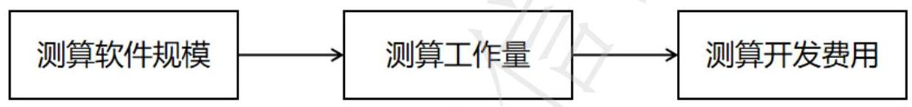

### 1 范围

本文件给出了信息系统商用密码应用成本测算的术语和定义、总体原则，并从成本构成、测算步骤、测算方法及报告等方面提出了建议。

本文件适用于信息系统中，基于密码服务平台的商用密码应用成本测算。

### 2 规范性引用文件

下列文件中的内容通过文中的规范性引用而构成本文件必不可少的条款。其中，注日期的引用文件，仅该日期对应的版本适用于本文件；不注日期的引用文件，其最新版本（包括所有的修改单）适用于本文件。

- GB/T 25069 信息安全技术 术语
- GB/T 36964 软件工程 软件开发成本测算规范
- GB/T 39786 安全技术 信息系统密码应用基本要求
- GB/T 42461 信息安全技术 网络安全服务成本度量指南
- GB/T 43207 信息安全技术 信息系统密码应用设计指南

### 3 术语和定义

GB/T 36964、GB/T 25069界定的以及下列术语和定义适用于本文件。

#### 3.1 商用密码 Commercial Cryptography

采用特定变换的方法对不属于国家秘密的信息等进行加密保护、安全认证的技术、产品和服务。

#### 3.2 密码应用方案 Cryptography Application Scheme

用于指导信息系统责任主体合规、正确、有效地使用密码技术，部署密码保障系统的规划。

[来源：GB/T 43207-2023，3.1]

### 4 总体原则

#### 4.1 全面性

通过系统化方式识别信息系统密码应用全生命周期各环节、各类型的成本要素。

#### 4.2 合理性

根据需求分析，选用适宜的测算方法，对商用密码应用的各类成本进行测算。

#### 4.3 准确性

基础数据来源可靠、计算过程严谨，成本测算结果能真实反映预期投入。

#### 4.4 规范性

成本测算的活动开展、流程执行及结果表达，应遵循统一规范。

### 5 成本构成

商用密码应用成本包括商用密码应用方案费、商用密码应用安全性评估费、云密码资源使用费、商用密码设备购置费、软件开发成本。

### 6 测算步骤

#### 6.1 需求分析

明确信息系统的业务需求和建设目标，确定信息系统商用密码应用的安全需求，包括系统部署位置、用户数量、维护开发人员数量、商用密码应用方案需求、商用密码应用安全性评估需求、商用密码设备购置需求、云密码资源使用需求、软件开发需求等。

#### 6.2 成本测算

##### 6.2.1 根据需求分析结果，选择各类成本适宜的测算方法。常见的测算方法如下：

- a） 类比法：参考国家或地区公布的产品指导价；
- b） 类推法：参考以往类似中标项目或项目合同案例中的有效价格，或通过市场询价方式确定市场行情价格；
- c） 方程法：建立参数模型，通过输入各项参数确定信息系统商用密码应用费用；
- d） 经验法：通过工作任务分解的形式，以最小工作任务内容或交付成果确定信息系统商用密码应用费用。

##### 6.2.2 采用不同的评估方法进行商用密码应用费用测算时，可选择如下方式：

- a） 在有类似的成功案例时，可参考成功案例进行测算；
- b） 利用行业基准数据对各项费用科目进行测算；
- c） 费用测算可采用多种方法分别开展，并通过交叉验证提升结果可靠性；若测算结果差异较大，可采用专家评审的方法确定测算结果。

##### 6.2.3 测算结果宜为一个范围值，并提供一个建议值。

#### 6.3 成本汇总

将各类成本进行汇总，计算出总成本。

#### 6.4 成本分析

对总成本进行分析，评估商用密码应用的经济性和可行性。

#### 6.5 报告编制

根据成本分析结果，编制成本测算报告。

### 7 测算方法

#### 7.1 商用密码应用方案费

##### 7.1.1 方案编制费

方案编制费可采用方程法或经验法。

采用方程法测算时，按人工成本计费。计算示例见附录A。

采用经验法测算时，应按照工作内容范围列明工作任务描述、工作成果、人员级别、工作量、人天单价等数据。

##### 7.1.2 方案评审费

方案评审费可采用方程法或类推法。

采用方程法测算时，按财政发放标准进行计算，评审专家人数不少于3人的单数。

采用类推法测算时，以采购结果为准。

方案评审费测算按式（1）进行计算：

$$
\mathrm {S R F} = \mathrm {N O R} * \mathrm {R U P} \tag {1}
$$

式中：

- SRF — 方案评审费，单位为万元；
- NOR — 评审人数，单位为人次；
- RUP — 评审单价，单位为万元。

##### 7.1.3 商用密码应用方案费

由方案编制费和方案评审费组成，按式（2）进行计算：

$$
\mathrm {C C A S F} = \mathrm {S P F} + \mathrm {S R F} \tag {2}
$$

式中：

- CCASF — 商用密码应用方案费，单位为万元；
- SPF — 方案编制费，单位为万元；
- SRF — 方案评审费，单位为万元；

注：上述公式仅为框架性质的描述，实际计算时需要根据具体项目的需求、规模、复杂度以及市场价格等因素进行调整和完善。同时，在计算过程中还需要考虑各种可能的变量和不确定性因素，以确保成本计算的准确性和可靠性。

#### 7.2 商用密码应用安全性评估费

可采用类比法或类推法。

采用类比法测算时，根据政府部门测算标准进行计算。

采用类推法测算时，以采购结果为准。

#### 7.3 云密码资源使用费

可采用类比法或类推法，综合云密码服务商收费标准、云密码资源配置、云密码资源使用时长等因素计算。

#### 7.4 商用密码设备购置费

可采用类比法或类推法。

明确设备的技术参数、配置、售后服务要求、品牌、型号等指标，并采用类比法、类推法中的一种或多种方式综合确定采购费用。

注：设备采购费用测算时，需考虑采购规模对单价的影响。

#### 7.5 软件开发成本

##### 7.5.1 测算流程

软件开发费用测算的基本流程如图1所示。

图1 软件开发费用测算流程

##### 7.5.2 测算软件规模

###### 7.5.2.1 功能点计数

采用功能点计数法测算软件规模，功能点计数法包括预估功能点计数法、估算功能点计数法。

在测算规模前应依据可行性研究报告或类似文档明确项目范围及系统边界。项目范围描述文档应包含最基本的业务需求，还应进行初步的子系统/模块划分，并对每一子系统或模块的基本用户需求进行描述或说明，根据项目范围描述文档进行预估功能点或估算功能点计数。

在预算申报阶段等需求功能尚不明确情况下宜采用预估功能点计数法，测算未调整的功能点数。

采用预估功能点计数法测算软件规模按式（3）计算：

$$
\mathrm{UFP} = \mathrm{a1} * \mathrm{ILF} + \mathrm{a2} * \mathrm{EIF} \tag{3}
$$

式中：

- UFP — 未调整的功能点数，单位为功能点；
- a1 — 单个内部逻辑文件功能点数分配常量35；
- ILF — 内部逻辑文件数，单位为个；
- a2 — 单个外部接口文件功能点数分配常量15；
- EIF — 外部接口文件数，单位为个；

在实施阶段、验收阶段等需求功能较为明确，数据、事务功能可识别的情况下，宜采用估算功能点计数法，测算未调整的功能点数。

采用估算功能点计数法测算软件规模按式（4）计算：

$$
\mathrm{UFP} = \mathrm{b1} * \mathrm{ILF} + \mathrm{b2} * \mathrm{EIF} + \mathrm{b3} * \mathrm{EI} + \mathrm{b4} * \mathrm{E0} + \mathrm{b5} * \mathrm{EQ} \tag{4}
$$

式中：

- UFP — 未调整的功能点数，单位为功能点；
- b1 — 单个内部逻辑文件功能点数分配常量10；
- ILF 一内部逻辑文件数，单位为个；
- b2 一单个外部接口文件功能点数分配常量7；
- EIF 一外部接口文件数，单位为个；
- b3 一单个外部输入功能点数分配常量4；
- EI 一外部输入数，单位为个；
- b4 一单个外部输出功能点数分配常量5；
- E0 一外部输出数，单位为个；
- b5 一单个外部查询功能点数分配常量4；
- EQ 一外部查询数，单位为个。

功能点计数的基本规则见附录C。

###### 7.5.2.2 软件规模测算

软件规模按式（5）进行计算。

$$
\mathrm{AFP} = \left(\sum_{i=1}^{n} \left(\mathrm{UFPI} * \mathrm{RUFI} * \mathrm{MCAi}\right)\right) * \mathrm{CF} \tag{5}
$$

式中：

- AFP 一调整后的功能点数，单位为功能点；
- UFPI 一未调整的功能点数，单位为功能点；
- RUFI 一吻合度调整因子，取值见附录C中表C.1；
- MCAi 一修改类型调整因子，取值见附录C中表C.2；
- CF 一规模调整因子，取值见附录C中表C.3。

##### 7.5.3 测算工作量

###### 7.5.3.1 软件因素调整因子

软件因素调整因子按式（6）进行计算。

$$
\mathrm{SWF} = \mathrm{SWF1} * \left[ (\mathrm{C1} + \mathrm{C2} + \mathrm{C3} + \mathrm{C4}) * 0.025 + 1 \right] \tag{6}
$$

式中：

- SWF 一软件因素调整因子；
- SWF1 一应用类型调整因子，取值见附录D中表D.1；
- C1 一质量特性调整因子之分布式处理因子，取值见附录D中表D.2；
- C2 一质量特性调整因子之性能因子，取值见附录D中表D.2；
- C3 一质量特性调整因子之可靠性因子，取值见附录D中表D.2；
- C4 一质量特性调整因子之多重站点因子，取值见附录D中表D.2。

###### 7.5.3.2 开发因素调整因子

开发因素调整因子按式（7）进行计算。

$$
\mathrm{RDF} = \mathrm{RDF1} * \mathrm{RDF2} \tag{7}
$$

式中：

- RDF 一软件因素调整因子；
- RDF1 一开发语言调整因子，取值见附录D中表D.3；
- RDF2 一开发团队背景调整因子，取值见附录D中表D.4。

###### 7.5.3.3 工作量测算

测算工作量按式（8）进行计算。

$$
\mathrm{AE} = \mathrm{AFP} * \mathrm{SWF} * \mathrm{RDF} \tag{8}
$$

式中：

- AE —测算工作量，单位为人时；
- AFP —调整后的功能点数，单位为功能点；
- SWF —软件因素调整因子；
- RDF —开发因素调整因子；

##### 7.5.4 测算开发费用

开发费用按式（9）进行计算。

$$
\mathrm{SDC} = \mathrm{AE} * \mathrm{SPBD} / 174 * \mathrm{F} \tag{9}
$$

式中：

- SDC —软件开发成本，单位为万元；
- AE —测算工作量，单位为人时；
- SPBD —软件生产率基准数据，单位为人时每功能点，取值见附录D中表D.5或本组织历史数据；
- 174 —人月折算系数，单位为人时（8×21.75）；
- F —软件开发基准人月费率，单位万元，取值参照浙江省财政厅相关平均人月费率规定。

##### 7.6 商用密码应用总成本测算

总成本按式（10）进行计算。

$$
\mathrm{TC} = \mathrm{CCASF} + \mathrm{CCAEF} + \mathrm{CCRUF} + \mathrm{CCEPF} + \mathrm{SDC} \tag{10}
$$

式中：

- TC —总成本，单位为万元；
- CCASF —商用密码应用方案费，单位为万元；
- CCAEF —商用密码应用安全性评估费，单位为万元。
- CCRUF —云密码资源使用费，单位为万元；
- CCEPF —商用密码设备购置费，单位为万元；
- SDC —软件开发成本，单位为万元；

注：在实际应用中，需要对上述公式中的各项成本进行具体测算。这通常涉及到市场调研、内部成本分析、风险评估等步骤。同时，由于信息系统的动态性和变化性，成本测算应该是一个持续的过程，需要定期更新和调整。

### 8 测算报告

报告包含需求分析、功能点测算和测算结果，具体示例见附录E。

### 附录 A （资料性） 人工成本计算示例

#### A.1 服务人员成本单价测算

各级别人员成本单价测算见公式A.1：

$$
\mathrm {P i} = \mathrm {S} * \mathrm {K i} * (1 + \mathrm {H}) \tag{A.1}
$$

式中：

- Pi —第i级服务人员成本单价，单位为元每人日(元/人日)；
- S —人员日平均工资，单位为元每人日(元/人日)，可参考国家统计局公布的各省市上一年信息传输、软件信息技术服务业年平均工资，以及行业或属地发布的网络安全从业人员平均工资，并按照日进行折算；
- Ki —服务人员级别调整系数，表A.1给出了3个网络安全服务人员级别调整系数取值范围；

表 A.1 商用密码应用服务人员级别调整系数

|  服务人员级别 | 调整系数 | 取值范围  |
| --- | --- | --- |
|  专家/资深 | K1 | 4～5  |
|  高级 | K2 | 2.5～4  |
|  中级 | K3 | 1.25～2.5  |
|  注：服务人员级别根据服务类型不同，可参考工作经验，工作年限、职业证书、学历等依据进行划分。  |   |   |

- H —人力成本调整系数，包含社保、公积金和管理成本，该系数建议取值范围为0.5～1。

示例：参考国家统计局发布的2024年信息传输、软件和信息技术服务业平均工资，2025年浙江省各级别网络安全服务人员成本综合单价测算如下：

商用密码应用服务人员日平均工资（S）为年平均工资（AS）除以年工作天数，其中每月工作天数取值为21.75，计算公式见式（A.2）：

$$
S = A S + (1 2 \times 2 1. 7 5) \tag{A.2}
$$

注：按照《中华人民共和国劳动法》第五十一条的规定，法定节假日用人单位应当依法支付工资，即折算日工资、小时工资时不剔除国家规定的11天法定节假日。据此，月计薪天数 = (365天 - 104天) ÷ 12月 = 21.75天。

商用密码应用服务人员级别调整系数（Ki）按照表1中最低值进行测算，K3取1.25，K2取2.5，K1取4；人力成本调整系数（H）取0.5。

综上计算得出2025年浙江省各级别网络安全服务人员成本单价（Pi）值，见表A.2。

表 A.2 2025年浙江省各级别网络安全服务人员成本单价

|  省份 | 年平均工资(元) | 日平均工资(元) | 各级别网络安全服务人员成本单价（元/人日）  |   |   |
| --- | --- | --- | --- | --- | --- |
|   |   |   |  中级（P3） | 高级（P2） | 专家（P1）  |
|  浙江 | 266974 | 1023 | 1790～3069 | 3069～4603 | 4603～5626  |
|  注：年平均工资是基于国家统计局发布的《2024年城镇单位就业人员年平均工资情况》中表7的“信息传输、软件和信息技术服务业”专业技术人员，可随着行业数据的变化而变化或参考本组织历史数据。  |   |   |   |   |   |

#### A.2 商用密码应用人工成本测算

商用密码应用方案编制费测算见公式A.3：

$$
\mathrm{SPF} = \left( \mathrm{P1} \times \mathrm{Q1} + \mathrm{P2} \times \mathrm{Q2} + \mathrm{P3} \times \mathrm{Q3} + \mathrm{P4} \times \mathrm{Q4} \right) / 10000 \tag{A.3}
$$

式中：

- SPF — 商用密码应用方案编制费，单位为万元；
- P — 第i级服务人员成本单价，单位为元每人日(元/人日)；
- Q — 第i级服务人员预估工时，单位为人日，总体工作量根据服务需求、服务规模和服务级别协议确定；

表 A.3 商用密码应用服务预估工时

|  服务名称 | 中级 | 高级 | 专家  |
| --- | --- | --- | --- |
|  商用密码应用方案咨询设计 | 5 | 1 | 1  |
|  注：商用密码应用方案编制费的预估工时是基于GB/T 42461-2023《信息安全技术 网络安全服务成本度量指南》中表C.3的“综合风险分析”的测算工时，可随着行业数据的变化而变化或参考本组织历史数据。  |   |   |   |

示例：商用密码应用人工成本测算：服务人员成本单价参考表A.2，服务预估工时参考表A.3，各级别服务人员成本单价和预计工时相乘后累加，得出方案编制费结果为 $1.66\sim 2.56$ 万元。根据示例中的取值，方案编制费取值为1.66万元。

### 附录 B （资料性） 功能点计数基本规则

#### B.1 功能点计数项分类

功能点计数项分为数据功能和事务功能两类，其中数据功能包括内部逻辑文件（ILF）、外部接口文件（EIF）；事务功能包括外部输入（EI）、外部输出（EO）、外部查询（EQ）。

数据功能是系统提供给用户的满足产品内部和外部数据需求的功能，体现系统管理或使用哪些业务数据（业务对象）。ILF或EIF所指的“文件”不是传统数据处理意义上的文件，而是指一组用户可识别的、逻辑上相互关联的数据或者控制信息。这些文件和物理上的数据集合（如数据库表）没有必然的对应关系。

事务功能是系统提供给用户的处理数据的功能，体现系统如何处理和使用那些业务数据（业务对象）。事务功能又称为基本过程，是用户可识别的，业务上的一组原子操作。

使用预估功能点计数法时，只需要识别数据功能，包括ILF和EIF；使用估算功能点计数法时，需要识别数据功能和事务功能，包括ILF、EIF、EI、EO和EQ。

**示例**：对于人事管理系统，“人员信息”、“部门信息”属于数据功能，“增加人员信息”、“修改部门信息”、“查询在岗人员”等则为事务功能。

#### B.2 ILF 的识别

ILF是系统内部维护的逻辑上的一组业务数据。识别ILF的基本步骤如下：

a） 识别业务对象。业务对象应是用户可理解和识别的，包括业务数据或业务规则。

注：为程序处理而维护的数据属于编码数据。所有的编码数据均不应识别为逻辑文件，与之相关的操作也不应识别为基本过程；

b） 确定逻辑文件数量。根据业务上的逻辑差异及从属关系确定逻辑文件的数量。

c） 是否是 ILF。确定该逻辑文件是否在本系统内进行维护。如果是，记为 ILF；否则为 EIF。

#### B.3 EIF 的识别

EIF是被应用边界内一个或几个基本处理过程所引用的业务数据。一个应用中的EIF应是其他应用中的ILF。识别EIF的基本步骤如下：

a） 识别业务对象。业务对象应该应是用户可理解和识别的。业务对象包括业务数据或业务规则。而一些为了程序处理而维护的数据则属于编码数据。所有的编码数据均不识别为逻辑文件，与之相关的操作也不识别为基本过程；

b） 确定逻辑文件数量。需要根据业务上的逻辑差异及从属关系确定逻辑文件的数量。

c） 是否是 EIF。确定该逻辑文件是否在本系统内进行维护。如果是，记为 ILF；否则为 EIF。

#### B.4 EI 的识别

EI是处理来自系统边界之外的数据或控制信息的过程。目的是维护一个或多个ILF或者改变系统的行为。识别EI的基本规则如下：

a） 应是来自系统边界之外的输入数据或控制信息；

b） 穿过边界的数据应是改变系统行为的控制信息或者应至少维护一个 ILF；

c） 该 EI 不应被重复计数。任何被分别计数的两个 EI 至少满足下面三个条件之一（否则应视为同一 EI）：

- 1） 涉及的 ILF 或 EIF 不同；
- 2） 涉及的数据元素不同；
- 3） 处理逻辑不同。

#### B.5 EO 的识别

EO是处理向系统边界之外发送数据或控制信息的过程。目的是向用户呈现经过处理的信息。识别EO的基本规则如下：

a） 将数据或控制信息发送出系统边界；

b） 处理逻辑应至少符合以下一种情况：

- 1） 包含至少一个数学公式或计算过程；
- 2） 产生衍生数据；
- 3） 维护至少一个 ILF；
- 4） 改变系统行为；

c） 该 EO 不应被重复计数。任何被分别计数的两个 EO 至少满足下面一个条件（否则被视为同一EO）：

- 1） 涉及的 ILF 或 EIF 不同；
- 2） 涉及的数据元素不同；
- 3） 处理逻辑不同。

#### B.6 EQ 的识别

EQ是向系统边界之外发送数据或控制信息的基本处理过程。目的是向用户呈现未经加工的已有信息。识别EQ的基本规则如下：

a） 将数据或控制信息发送出系统边界。
b） 处理逻辑可包含筛选、分组或排序。
c） 处理逻辑不应包含：

- 1） 数学公式或计算过程；
- 2） 产生衍生数据；
- 3） 维护 ILF；
- 4） 改变系统行为。

d） 该 EQ 不应被重复计数。任何被分别计数的两个 EQ 至少满足下面一个条件标准则被视为同一 EQ）：

- 1） 涉及的 ILF 或 EIF 不同；
- 2） 涉及的数据元素不同；
- 3） 处理逻辑不同。

#### B.7 功能点识别示例表

功能点识别示例见表B.1。

表 B.1 功能点识别示例表

|  功能项名称 | 实现方式 | 类别-描述  |
| --- | --- | --- |
|  普通用户身份鉴别（必选） | 应用软件-浙政钉对接 | EIF-浙政钉/浙里办组织架构  |
|   |   |  EI-获取用户是否登录的控制信息  |
|  运维人员身份鉴别 | ukey 身份认证 | EIF-签名验签数字证书  |
|   |   |  EI-获取维护人员是否登录的控制信息  |
|  运维人员身份鉴别 | 调用签名验签接口 | EIF-签名验签数字证书  |
|   |   |  EI-获取维护人员是否登录的控制信息  |
|  角色访问控制信息完整性 | 调用签名验签接口 | EIF-签名验签数字证书  |
|   |   |  EI-获取访问控制信息是否完整的控制信息  |
|  个人敏感数据机密性（必选） | 调用加解密接口 | ILF-个人敏感数据信息  |
|   |   |  EI-获取个人敏感信息加解密后的 ILF 信息  |
|  重要数据存储机密性（必选） | 调用加解密接口 | ILF-重要数据信息  |
|   |   |  EI-获取重要数据加解密后的 ILF 信息  |
|  个人敏感数据完整性 | 调用签名验签接口 | EIF-签名验签数字证书  |
|   |   |  EI-获取个人敏感信息是否完整的控制信息  |
|  重要数据存储完整性 | 调用签名验签接口 | EIF-签名验签数字证书  |
|   |   |  EI-获取重要数据是否完整的控制信息  |
|  操作日志和登录日志完整性保护 | 调用签名验签接口 | EIF-签名验签数字证书  |
|   |   |  EI-获取操作和登录日志数据是否完整的控制信息  |

### 附录 C （资料性） 调整后的功能点数计算

#### C.1 吻合度调整因子参数表

吻合度调整因子参数见表C.1。

表 C.1 吻合度调整因子

|  吻合度 | 调整因子  |
| --- | --- |
|  低 | 1  |
|  中 | 2/3  |
|  高 | 1/3  |
|  注：吻合度调整因子是基于中国软件行业基准数据（CSBMK®-202510）版本中的表A.2，可随着行业数据的变化而变化。  |   |

#### C.2 修改类型调整因子参数表

修改类型调整因子参数见表C.2。

表 C.2 修改类型调整因子

|  修改类型 | 调整因子  |
| --- | --- |
|  新增 | 1  |
|  修改 | 0.8  |
|  删除 | 0.2  |
|  注：修改类型调整因子是基于中国软件行业基准数据（CSBMK®-202510）版本中的表A.1，可随着行业数据的变化而变化。  |   |

#### C.3 规模调整因子参数表

规模调整因子参数见表C.3。

表 C.3 规模调整因子

|  项目阶段 | 调整因子  |
| --- | --- |
|  项目概算、预算阶段 | 1.39  |
|  项目投标、计划阶段 | 1.21  |
|  项目需求分析阶段 | 1.10  |
|  项目交付及运维阶段 | 1.00  |
|  注：规模调整因子是基于中国软件行业基准数据（CSBMK®-202510）版本中的4.8，可随着行业数据的变化而变化。  |   |

### 附录 D （资料性） 测算开发费用

#### D.1 应用类型调整因子参数表

应用类型调整因子参数见表D.1。

表 D.1 应用类型调整因子

|  应用类型 | 范围 | 调整因子  |
| --- | --- | --- |
|  业务处理 | 办公自动化系统；人事、会计、工资、销售等经营管理及业务处理用软件等 | 1.0  |
|  科技 | 科学计算、模拟、统计分析等 | 1.2  |
|  多媒体 | 图形、影像、声音等多媒体应用领域；地理信息系统；教育和娱乐等 | 1.3  |
|  智能信息 | 自然语言处理、大模型、计算机视觉、智能决策、专家系统等 | 1.5  |
|  基础软件/支撑软件 | 操作系统、数据库系统、集成开发环境、自动化开发/设计工具等 | 1.7  |
|  通信控制 | 通信协议、仿真、交换机软件、全球定位系统等 | 1.9  |
|  流程控制 | 生产管理、机器人控制、嵌入式软件等 | 2.0  |
|  注：应用类型调整因子是基于中国软件行业基准数据（CSBMK®-202510）版本中的表A.3，可随着行业数据的变化而变化。  |   |   |

#### D.2 质量特征调整因子参数表

质量特征调整因子参数见表D.2。

表 D.2 质量特征调整因子

|  调整因子 |   | 判断标准 | 影响度  |
| --- | --- | --- | --- |
|  分布式处理 | 指应用能够在各组成要素之间传输数据 | 没有明示对分布式处理的需求事项 | -1  |
|   |   |  通过网络进行客户端/服务器及网络基础应用分布处理和传输 | 0  |
|   |   |  在多个服务器及处理器上同时相互执行应用中的处理功能 | 1  |
|  性能 | 指用户对应答时间或处理率的需求水平 | 没有明示对性能的特别需求事项或活动，因此提供基本性能 | -1  |
|   |   |  应答时间或处理率对高峰时间或所有业务时间都很重要，对连动系统结束处理时间有限制 | 0  |
|   |   |  为满足性能需求事项，要求设计阶段进行性能分析，或在设计、开发阶段使用分析工具 | 1  |
|  可靠性 | 指发生故障的影响程度 | 没有明示对可靠性的特别需求事项或活动，因此提供基本的可靠性 | -1  |
|   |   |  发生故障时可轻易修复，带来一定不便或经济损失 | 0  |
|   |   |  发生故障时很难修复，发生重大经济损失或有生命危害 | 1  |
|  多重站点 | 指能够支持不同硬件和软件环境 | 在相同用途的硬件或软件环境下运行 | -1  |
|   |   |  在用途类似的硬件或软件环境下运行 | 0  |
|   |   |  在不同用途的硬件或软件环境下运行 | 1  |
|  注：根据可研报告或初步设计中对分布式处理、性能、可靠性、多重站点的特性要求取值。质量特征调整因子是基于中国软件行业基准数据（CSBMK®-202510）版本中的表A.5，可随着行业数据的变化而变化。  |   |   |   |

#### D.3 开发语言调整因子参数表

开发语言调整因子由软件开发程序逻辑的复杂性、实现难度等因素决定，参考值见表D.3。

表 D.3 开发语言调整因子

|  开发语言 | 调整因子  |
| --- | --- |
|  C及其他同级别语言/平台 | 1.2  |
|  JAVA、C++、C#及其他同级别语言/平台 | 1.0  |
|  PowerBuilder、ASP及其他同级别语言/平台 | 0.8  |
|  注：开发语言调整因子是基于中国软件行业基准数据（CSBMK®-202510）版本中的表A.6，可随着行业数据的变化而变化。  |   |

#### D.4 开发团队背景调整因子参数表

开发团队背景调整因子参数见表D.4。

表 D.4 开发团队背景调整因子

|  调整因子 | 因子数值 | 影响度  |
| --- | --- | --- |
|  同类行业及项目的以往经验 | 为本行业开发过类似的项目 | 0.8  |
|   |  为其他行业开发过类似的项目，或为本行业开发过不同但相关的项目 | 1.0  |
|   |  没有同类项目的背景 | 1.2  |
|  注：开发团队背景调整因子是基于中国软件行业基准数据（CSBMK®-202510）版本中的表A.7，可随着行业数据的变化而变化。  |   |   |

#### D.5 生产率基准数据参数表

生产率基准数据表见表D.5。

表 D.5 各行业生产率基准数据
单位为人时/功能点

|  业务领域 | P10 | P25 | P50 | P75 | P90  |
| --- | --- | --- | --- | --- | --- |
|  电子政务 | 2.04 | 2.87 | 6.41 | 10.99 | 15.36  |
|  金融 | 3.08 | 5.09 | 10.46 | 15.69 | 27.15  |
|  电信 | 2.36 | 4.57 | 9.98 | 16.37 | 27.68  |
|  制造 | 2.08 | 3.31 | 7.69 | 15.93 | 23.78  |
|  能源 | 2.15 | 3.79 | 7.30 | 17.42 | 22.13  |
|  交通 | 2.03 | 3.07 | 6.86 | 15.57 | 21.55  |
|  注：生产率基准数据是基于中国软件行业基准数据（CSBMK®-202510）版本的数据库，可随着行业基准数据的变化而变化。生产率基准数据通常使用P50的取值测算工作量、费用的最有可能值，使用P25和P75的值分别测算上下限。特殊情况（如项目目标约束极其严格）下，也可采用P10和P90的值测算上下限。  |   |   |   |   |   |

### 附录 E （资料性） 测算报告示例

#### E.1 需求分析

- （1）该三级系统只有一个子系统，服务器部署在政务云，政务网使用，用户2000个，并发100，维护及开发人员3人。
- （2）普通用户终端国密浏览器大部分集中采购。
- （3）需要单独采购ss1密码模块1个、国密浏览器3个、国密站点证书1个。
- （4）需要对应用系统进行软件开发，以便调用密码服务能力，开发用java语言。
- （5）不需要协助建立密码管理制度，不需要密码改造培训。
- （6）需要制定密码方案，开展方案评审，并开展密评。
- （7）识别的功能点参考附录B中表B.1。

#### E.2 功能点测算

该三级系统需拟进行商用密码应用软件开发，以支持其使用密码技术实现普通用户身份鉴别、运维人员身份鉴别、角色访问控制信息完整性、个人敏感数据机密性、个人敏感数据完整性、重要数据存储机密性、重要数据存储完整性、操作日志和登录日志完整性保护等，参考附录B中表B.1。采用估算功能点计数法，假设根据需求描述可以识别出需求中包含 2 个 ILF，7个 EIF，9个EI，因此，此部分需求调整后的功能点数 AFP 为 59.47。计算内容见表E.1。

表 E.1 成本功能点计算示例

|  功能项名称 | 实现方式 | 类别-描述 | 类别 | 重用程度 | 修改类型 | 功能数量 | 重用程度 | 功能类型系数 | 估算功能点计数法  |
| --- | --- | --- | --- | --- | --- | --- | --- | --- | --- |
|  普通用户身份鉴别（必选） | 应用软件-浙政钉对接 | EIF-浙政钉/浙里办组织架构 | EIF | 低 | 修改 | 1 | 1 | 0.8 | 5.60  |
|   |   |  EI-获取用户是否登录的控制信息 | EI | 低 | 修改 | 1 | 1 | 0.8 | 3.20  |
|  运维人员身份鉴别 | ukey 做身份认证 | EIF-签名验签数字证书 | EIF | 低 | 修改 | 1 | 1 | 0.8 | 5.60  |
|   |   |  EI-获取维护人员是否登录的控制信息 | EI | 低 | 修改 | 1 | 1 | 0.8 | 3.20  |
|  运维人员身份鉴别 | 调用签名验签接口 | EIF-签名验签数字证书 | EIF | 中 | 修改 | 1 | 2/3 | 0.8 | 3.73  |
|   |   |  EI-获取维护人员是否登录的控制信息 | EI | 中 | 修改 | 1 | 2/3 | 0.8 | 2.13  |
|  角色访问控制信息完整性 | 调用签名验签接口 | EIF-签名验签数字证书 | EIF | 中 | 修改 | 1 | 2/3 | 0.8 | 3.73  |
|   |   |  EI-获取访问控制信息是否完整的控制信息 | EI | 中 | 修改 | 1 | 2/3 | 0.8 | 2.13  |
|  个人敏感数据机密性（必选） | 调用加解密接口 | ILF-个人敏感数据信息 | ILF | 低 | 修改 | 1 | 1 | 0.8 | 8.00  |
|   |   |  EI-获取个人敏感信息加解密后的 ILF 信息 | EI | 低 | 修改 | 1 | 1 | 0.8 | 3.20  |
|  个人敏感数据完整性 | 调用签名验签接口 | EIF-签名验签数字证书 | EIF | 高 | 修改 | 1 | 1/3 | 0.8 | 1.87  |
|   |   |  EI-获取个人敏感信息是否完整的控制信息 | EI | 高 | 修改 | 1 | 1/3 | 0.8 | 1.07  |
|  重要数据存储机密性（必选） | 调用加解密接口 | ILF-重要数据信息 | ILF | 低 | 修改 | 1 | 1 | 0.8 | 8.00  |
|   |   |  EI-获取重要数据加解密后的 ILF 信息 | EI | 中 | 修改 | 1 | 2/3 | 0.8 | 2.13  |
|  重要数据存储完整性 | 调用签名验签接口 | EIF-签名验签数字证书 | EIF | 高 | 修改 | 1 | 1/3 | 0.8 | 1.87  |
|   |   |  EI-获取重要数据是否完整的控制信息 | EI | 高 | 修改 | 1 | 1/3 | 0.8 | 1.07  |
|  操作日志和登录日志完整性保护 | 调用签名验签接口 | EIF-签名验签数字证书 | EIF | 高 | 修改 | 1 | 1/3 | 0.8 | 1.87  |
|   |   |  EI-获取操作和登录日志数据是否完整的控制信息 | EI | 高 | 修改 | 1 | 1/3 | 0.8 | 1.07  |
|  规模调整前总计: |   |   |   |   |   |   |   |   | 59.47  |
|  规模调整因子: |   |   |   |   |   |   |   |   | 1  |
|  AFP（调整后规模总计）： |   |   |   |   |   |   |   |   | 59.47  |

#### E.3 测算结果

计算内容见表E.2。

表 E.2 成本计算示例

|  名称 | 规格/说明 | 数值 | 单位 | 备注  |
| --- | --- | --- | --- | --- |
|  1. 商用密码应用方案费 |  | 2.06 | 万元 |   |
|  方案编制费 | 1 个系统 | 1.66 | 万元 | 用附录 A 人工成本公式计算。  |
|  方案评审费 | 1 个系统 | 0.4 | 万元 | 机构评审以采购结果为准。
如专家评审，按财政的发放标准进行计算。  |
|  2. 商用密码应用安全性评估费 | 1 个系统 | 2.8 | 万元 | 参照政府部门测算标准。  |
|  3. 商用密码资源使用费 |  | 0 | 万元 | 参考使用政府投资商用密码云资源平台  |
|  密钥管理 | 1 个应用/年 | 0 | 万元 | 平台已具备功能，由平台统一提供服务，不需要额外费用；如需要另外采购功能，以市场采购价为准。  |
|  数据加解密 | 1 个虚机/年（含文件加解密、批量加解密） | 0 | 万元 | 平台已具备功能，由平台统一提供服务，不需要额外费用；如需要另外采购功能，以市场采购价为准。  |
|  可信安全 | 1 个虚机/年 | 0 | 万元 | 平台已具备功能，由平台统一提供服务，不需要额外费用；如需要另外采购功能，以市场采购价为准。  |
|  身份认证 | 1 个应用/年 | 0 | 万元 | 平台已具备功能，由平台统一提供服务，不需要额外费用；如需要另外采购功能，以市场采购价为准。  |
|  4. 商用密码设备购置费 |  | 3.41 | 万元 |   |
|  ssl 密码模块 | 1 个 | 3 | 万元 | 采购以采购结果为准。  |
|  国密浏览器 | 5 个 | 0.06 | 万元 | 采购以采购结果为准。  |
|  国密站点证书 | 1 个/年 | 0.3 | 万元 | 采购以采购结果为准。  |
|  ukey+个人证书 | 5 个/年 | 0.05 | 万元 | 采购以采购结果为准。  |
|  云主机或其他需单独购置的密码产品 |  | 0 | 万元 | 采购以市场询价为准。  |
|  5. 软件开发成本 | 按照常规取 P25 | 1.96 | 万元 | SPBD 一般取值 P25、P50、P75，推荐 P50。  |
|   |  按照常规取 P50 | 4.38 | 万元  |   |
|   |  按照常规取 P75 | 7.51 | 万元  |   |
|  AFP-调整后的功能点数 |  | 59.47 | 个 | 因需求较为明确，采用估算功能点计数法计算。  |
|  软件开发成本其他参数 | \ | \ | \ |   |
|  SWF-软件因素调整因子 |  | 1 |  |   |
|  SWF1-应用类型调整因子 | 业务处理 | 1 |  | 参考表 D. 1  |
|  C1-分布式处理因子 | 客户端/服务器 | 0 |  | 参考表 D. 2  |
|  C2-性能因子 | 应答时间或处理率 | 0 |  | 参考表 D. 2  |
|  C3-可靠性因子 | 可轻易修复 | 0 |  | 参考表 D. 2  |
|  C4-多重站点因子 | 类似的硬件或软件环境 | 0 |  | 参考表 D. 2  |
|  RDF-开发因素调整因子 |  | 1 |  |   |
|  RDF1-开发语言调整因子 | 使用用 java 语言开发 | 1 |  | 参考表 D. 3  |
|  RDF2-开发团队背景调整因子 | 为本行业开发过不同但相关的项目 | 1 |  | 参考表 D. 4  |
|  SPBD-软件生产率基准数据 | 按照常规取 P25 | 2.87 |  | 参考表 D.5，一般取值 P25、P50、P75，推荐 P50。  |
|   |  按照常规取 P50 | 6.41 |   |   |
|   |  按照常规取 P75 | 10.99 |   |   |
|  F-软件开发基准人月费率 | 取值 2 万 | 2 | 万元 | 参照浙江省财政厅相关平均人月费率规定取值。  |
|  6. 总成本 | 10.23 | 万元 |   |   |
|   |   |  12.65 | 万元 |   |
|   |   |  15.78 | 万元 |   |

综上，成本测算结果为：应用系统软件开发成本取中值 = 4.47 万元；商密应用总成本取中值 = 2.06 + 2.8 + 0 + 3.41 + 4.38 = 12.65 万元。

### 参考文献

[1] GB/T 43206—2023 信息安全技术 信息系统密码应用测评要求